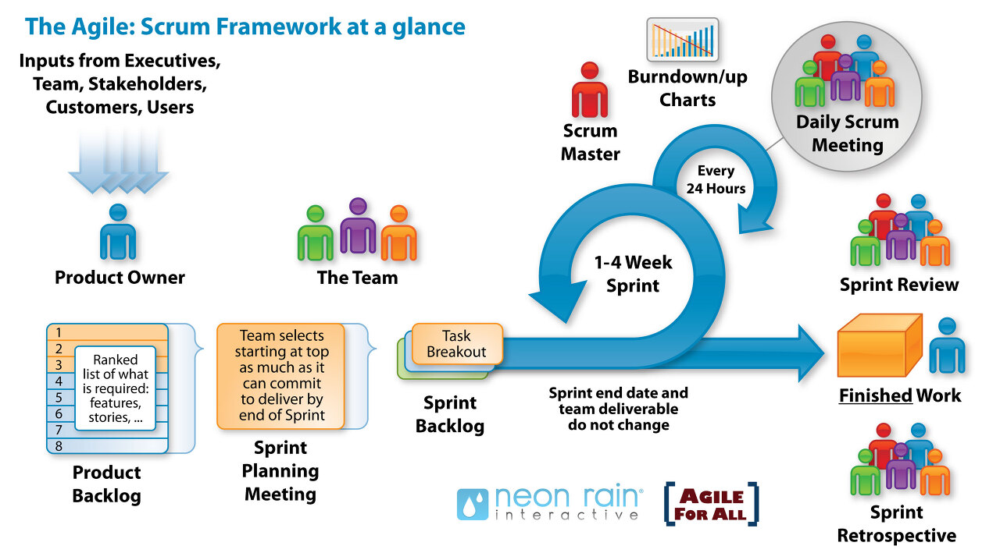
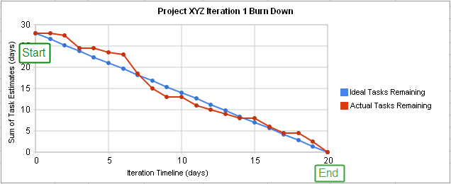

# 스크럼이란

팀이 중심이 되어 개발의 효율성을 높인다는 의미가 내포된,

애자일 소프트웨어 개발의 실천 방법 중 하나

---
<!-- paginate: true -->
# 제품 책임자
*PO; Product Owner*

1. 이해관계자들 중 개발될 제품에 대한 이해도가 높고, 요구사항을 책임지고 의사 결정할 사람으로 선정
2. 이해관계자들의 의견을 종합하여 제품에 대한 요구사항 즉 백로그(Backlog)를 작성하는 주체
3. 요구사항이 담긴 백로그를 작성하고 백로그에 대한 우선순위를 지정한다.

---

# 제품 책임자

* 팀원들이 백로그에 스토리를 추가할 수는 있지만  
  
   우선순위를 지정할 수는 없다.
* 주기적으로 요구사항의 우선순위를 갱신한다.
* 비즈니스 요구사항을 정의할 수 있는 사람이 좋다.

---

# 스크럼 마스터
*SM; Scrum Master*

* 스크럼 팀이 스크럼을 잘 수행할 수 있도록    
  
  객관적인 시각에서 조언을 해주는 가이드 역할
*  통제자가 아니다!
* 일일 스크럼 회의를 주관하여 진행 사항을 점검
*  개발 과정에서 발생된 장애 요소를 공론화하여 처리

---

# 스크럼 마스터

* 팀 구성원 간의 분쟁
* 하는 일에 대한 우선순위 선정
* 스프린트 업무의 종료를 확인하는 책임자.

---

# 개발팀
*DT; Development Team*
1. 제품 책임자와 스크럼 마스터를 제외한 모든 팀원  
    * 개발자 외에도 디자이너, 테스터 등 참여하는 모든 사람

---

## **백로그**
제품 개발에 필요한 요구사항을 모두 모아 우선순위를 부여해 놓은 목록

## **스토리**
백로그에 담겨질 요구사항은  

'고객은 상품 주문을 위해 로그인을 수행해야 한다.'

동사로 서술하는 형태가 되어야함.  
그래서,
백로그에 작성되는 요구사항을 스토리 또는 사용자 스토리라고 함

---

|스크럼 개발 프로세스|
|:---:|
|제품 백로그|
|⬇|
|스프린트 백로그|
|⬇|
|스프린트 수행 |
|⬇|
|스프린터 검토 회의  스프린트 회고|

---

# 제품 백로그 (Product Backlog)

1. 제품 개발에 필요한 모든 요구사항을 우선순위에 따라 나열한 목록
2. 개발 과정에서 새롭게 도출되는 요구사항으로 인해 지속적으로 업데이트 됨
3. 제품 백로그에 작성된 사용자 스토리를 기반으로 전체 일정 계획인 릴리즈 계획을 수립
4. 소프트웨어 개발자들이 사용하는 용어들이 들어가서는 안된다. 
    - 예) 제작공정에 따른 필요사항을 더블클릭으로 확인할 수있어야한다.

---

# 스프린트 계획 회의 (Sprint Planning Meeting)
1. 제품 백로그 중 이번 스프린트에서 수행할 작업을 대상으로 단기 일정을 수립하는 것
2. 스프린트에서 처리할 요구사항을 개발자들이 나눠서 작업할 수 있도록 태스크라는 작업 단위로 분할한 후 개발자별로 수행할 작업 목록인 스프린트 백로그를 작성

---

# 일일 스크럼 회의(Daily Scrum Metting)
1. 모든 팀원이 매일 약속된 시간에 약 15분 정도의 짧은 시간동안 진행 사항을 점검
2. 회의는 보통 서서 진행하며, 남은 작업 시간은 소멸 차트(Burn-down Chart)에 표시
3. 스크럼 마스터는 발견된 장애 요소를 해결할 수 있도록 도와줌
4. 어제 한일, 오늘 할 일, 이슈 사항에 대해 공유한다.

---

# 스프린트(Sprint)
1. 실제 개발 작업을 진행하는 과정으로, 보통 2~4주 정도의 기간 내에서 진행
2. 스프린트 백로그에 작성된 태스크를 대상으로 작업 시간(양)을 추정한 후 개발 담당자에게 할당
3. 태스크를 할당할 때는 개발자가 원하는 태스크를 직접 선별하여 담당할 수 있도록 하는것이 좋다.
4. 개발 담당자에게 할당된 태스크는 보통 할 일(To Do), 진행 중(In Progress), 완료(Done)의 상태를 가짐

---

## 소멸 차트
해당 스프린트에서 수행할 작업의 진행 상황을 확인할 수 있도록,  
시간의 경과에 따라 **남은 작업 시간**을 그래프로 표현  
초기에 추정했던 전체 작업 시간은 작업이 진행될수록 **점점 줄어들게 됨**

---

# 스프린트 검토 회의 (Sprint Review)
1. 부분 또는 전체 완성 제품이 요구사항에 잘 부합되는지 사용자가 포함된 참석자 앞에서 테스팅을 수행
2. 스프린트의 한 주당 한 시간 내에서 진행
3. 제품 책임자는 개선할 사항에 대한 피드백을 정리한 후 다음 스프린트에 반영할 수 있도록 제품 백로그를 업데이트

---

# 스프린트 회고(Sprint Retrospective)
1. 스프린트 주기를 되돌아보며 정해놓은 규칙을 잘 준수했는지, 개선할 점은 없는지 등을 확인하고 기록
2. 해당 스프린트가 끝난 시점에서 수행하거나 일정 주기로 수행
3. 업무에 관한 내용만 있는 것이 아닌 개인적이 일정이나 팀내부적인 갈등상황을 해결하기 위한 자리.
