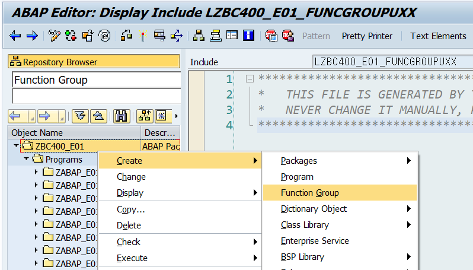
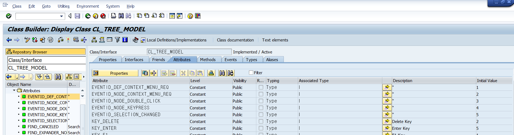
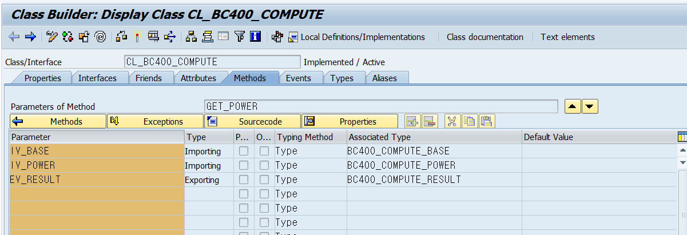

# Modularization Techniques
### 모듈화의 이점
- 소스코드의 유지보수하기 쉽다.
- 소스코드가 간결해진다.
- 재사용이 용이하다.

## B1.P230
### 모듈화 방법
    전역 모듈과 지역 모듈 모두 생성가능하다.

1. Subroutine
2. Function Module
3. Method of Class
- Data Encapsulation
    모듈프로그램과 메인 프로그램은 인터페이스 파라미터를 이용하여 데이터를 교환한다.

- 모듈 프로그램 호출은 Exporting과 Importing 구문을 사용한다.

```abap
    call Function '펑션명'
        Exporting
        ...
        importing
        ...
```


---
## **Subroutine**
### B1.P270

#### 구성체의 모습
```ABAP
    Form "서브루틴 이름".
        Using
          value(변수)    - call by value
        changing 
            value(변수)  - call by value and Result
            변수         - call by Reference
    ENDFORM.  
```

    메인 프로그램에서 호출시에는 
```abap
    PERFORM "서브루틴 이름" (USING|CHANGING) '변수명' 
                                            '변수명'.   "여기까지 다 작성하고 서브루틴 이름 더블클릭!
```
    전역변수를 직접 서브루틴에서 사용이 가능하지만,  
    가능하다면 기존에 정의된 파라미터(=formal parameter)를 사용할 것을 권장함.

#### 데이터 인터페이스 방식의 종류
1. call by value  
    Actual value를 복사하여 서브루틴으로 전달만 한다.
2. call by value and result  
    복사된 데이터가 서브루틴에서 변경되면 
    서브루틴이 종료됐을때 변경된 값이 메인 프로그램으로 반환된다.
3. call by Reference  
    서브루틴에서 값이 변경되면 즉시 메인 프로그램의 파라미터값이 변경이 된다.  

- 결과적으로 보면 CVR과 CR은 동일함. 하지만 결과 값이 ***전달되는 시기***에 있어서 차이가 있다.
- CV와 CVR은 변수의 실제 메모리값을 복사한다.
- CR은 변수의 메모리 주소헤더를 이용한다.
- 레퍼런스로 선언할때 using을 사용하던 changing을 사용하던 상관없다.

#### 서브루틴 생성
1.  메인프로그램에서 - create - subroutine 메뉴 실행함.  
    팝업 창에서 서브루틴 이름을 지정하면 자동 생성됨.
2.  PERFORM 구문 직접 작성 후 이름을 Double Click

#### ANY 데이터 타입의 문제점
    ANY TYPE 은 입력인자의 데이터 타입에 상관없이 입력값을 전달 받는다.  
    Subroutine의 Formal parameter의 데이터 타입을 ANY 타입으로 지정한다면 최초에 문법오류는 없다.  
    하지만 만약 Actual Parameter에 잘못된 값이 반환된다면 런타임 덤프가 발생된다.

#### Subroutine 내부 데이터 타입
    메인프로그램의 전역변수를 서브루틴내부에서 사용이가능하고 
    서브루틴 내부에서 변수를 생성하여 지역 변수로 이용할 수 있다.

#### 서브루틴 호출 방식
- Ctrl+f6 Pattern 메뉴에서 poerform 박스에서 호출
- 네비게이션에서 드래그앤 드랍
- 서브루틴 인자는 순서에 따라 matching된다.

---


## **Function Module**
### B1.P315
    펑션 모듈은 전역 펑션그룹에서 관리된다.  

    펑션그룹내부에는 그룹 내부 데이터 오브젝트가 존재한다.  

    펑션그룹내의 펑션모듈은 상호 접근이 가능하다.  

    펑션 그룹내부에서 서브루틴을 제작하여 각 펑션모듈이 호출하여 사용이 가능하다.  

    펑션 그룹은 스크린을 데이터 오브젝트로 보관이 가능하다.  

    펑션 모듈 내부에서 로컬변수를 선언할 수 있다.  

#### **Function Group**
    SE37 Function Builder에서 확인이 가능하다.
    속성, 입-출력 인자관리, 테이블관리 등이 가능하다.
    한개의 그룹에 20개 이상의 모듈을 입력하지 않는다.
    ABAP에서는 펑션 모듈은 그룹과 같이 Load 된다.

#### Function Group Naming 
    Z혹은 Y로 Naming 해야한다.
    pre-pix로 펑션 그룹 이름 앞에 SAPL이 붙는다.
    펑션그룹도 항상 ACTIVATE!!!

#### 펑션 그룹 생성 B1.P332
1. Object Navigator에서 생성하는 방법
2. Package List에서 생성하는 방법  


3. 펑션빌더(se37)에서 생성하는 방법  
    SE80에서 네이밍 규칙에 따라 생성
    Impoirt 인자와 Export 인자를 작성함

    Function Group을 생성했다면 펑션그룹을 Double Click해서 master code에 진입한다.
    

##### 펑션 그룹 내부 Source Code
```abap
    FUNCTION '펑션그룹명'
        sourcecode
    ENDFUNCTION
```

펑션 그룹 안에는 자동적으로  
-    전역변수를 입력할 수 있는 "펑션그룹명TOP"파일과
-    지역변수를 입력할 수 있는 "펑션그룹명UXX"파일이 생성됨.


#### **Interface**
    각각의 펑션 모듈은 호출될때 데이터를 교환하기 위한 인터페이스가 존재한다.  
- 임포트 파라미터  
    순수하게 펑션 모듈에 입력되는 인자
- 익스포트 파라미터  
    순수하게 펑션 모듈에서 출력되는 인자
- 체인징 파라미터  
    펑션모듈에서 입-출력이 모두 가능한 인자
- Exeption  
    에러발생시 예외 처리용 인자 

#### B1.P319
    펑션모듈 인터페이스 관리 화면

#### **Function Module 생성**
    그룹과 동일한 방식으로 생성

    Import와 Export , Exeption 속성을 입력하면 소스코드 템플릿이 생성됨.
    
    소스코드 Tool area 에서 소스코드 작성.


#### 프로그램 내부에서 Function 호출 코드
```abap
    CALL fUNCTION '펑션모듈명'

    EXPORTING    "Function에게 입력 
        '입력인자명' = '변수명'

    IMPORTING    "Function에서 출력"
        '출력인자명' = '변수명'
        'sourcecode'
    Exceptions
        '예외명' = 1
        Others   = 2.
```
#### Function 호출 방식
- Ctrl+f6 Pattern 메뉴에서 Function 박스에서 호출
- 네비게이션에서 드래그앤 드랍

#### B1.P32 예외처리 방법
    sy-subrc를 이용하여 펑션 에러 메시지 출력
```abap
    case sy-subrc.

    when 0.
        '정상 소스코드'
    when 1.
        message '에러메세지' type 'I'
    endcase.    
```

---
## **BAPIs** B1.P346
    Business Application Programming Interfaces.

    T-code  = BAPI

    BAPI는 Function으로 구성되어있음.

    BAPI를 통한 테이블 handling은 SQL을 이용하여 진행하고

    SAP에서 생성된 테이블은 BAPI 또는 Function을 통해 handling 해야함.

    BAPI를 포함한 Function Group은 
    BAPI Function이라고 부르며,
    스크린과 Exeption을 가질 수 없다.

    예외 처리는 익스포트나 테이블 안에 
    REturn 파라미터를 가지고 

    return 함수는 structure or internal table

#### BAPI 호출 방식
    Function과 동일하다.

## **Method** B1.P354

    ABAP은 OOP로 발전했다.그래서 CLASS의 개념이 존재한다.

### CLASS
    구성요소
    - Attrubutes (data object)
        - Static
        - Instance
        - Contants
    - Method (Function)  
        - Stactic Methiod는 해당 클래스에 한개만 존재하는 Method를 의미한다.
        - Instance Method는 마다 존재하는 Method를 의미한다.

    접근성  
    - Public : 무제한 일반 접근이 가능함  
        외부 프로그램에서 접근하게 하기위해서 설정 필요.
    - Private : 해당 클래스 내에서만 접근 가능함

### CLASS의 생성 B1.P370
    - Object Navigator에서 생성
    - SE24 CLass Builder에서 생성

#### ATributes의 설정



### Method의 설정


### Method의 호출
    Function 호출과 동일함.
1. Pattern을 이용한 방법  
    1. ABAP Objects Patterns  
    2. CALL METHOD 
    3. class와 메소드 이름 입력  


2. Navigator Object list를 이용하는 방법

### 예외사항 관리하기
1. classic Exeption Handling  
    Exception 이름을 설정하여 생성하는 방법
```abap
    case sy-subrc 
        when ...
            ...
    endcase
```

2. Exeption class Handling  
    예외 클래스는 CX_로 시작됨.

```abap
    TRY.
        '메쏘드 호출'
    catch 'Exeption 확인'.
        '예외처리'
    ENDTRY
```

### Instance 생성과 관리 B1.P367

    Refernce variable을 이용하여 오브젝트를 관리할 수 있다.

```abap
    DATA '변수명' TYPE REF TO '클래스명'
    
    SOURCE CODE

    CREATE OBJECT '변수명' ...
    EXPORTING ...

    SOURCE CODE 

    CALL METHOD '변수명' -> '메쏘드 변수명'
        EXPORTING ...
        IMPORTING ...
        EXCEPTION ...

```

#### B1.P372

Signature of class == parameter of Function

Shift + f9 시그니쳐 확인 단축키  
 해당 메소드와 연결된 파라미터 확인가능  
 필수적으로 잘 보자!!!

메쏘드 단축키로 만들면서 Shift + Enter 하면 자동으로 템플릿 생성해줌.

---
### Local Class
    로컬 클래스는 자동입력이 안되고 손코딩해야한다.

#### B1.P381
- 로컬 클래스의 구성체
```abap
    CLASS lcl_'클래스명' DEFINITION.
    PUBLIC SECTION.      "퍼블릭이 무조건 먼저 정의되야한다.
        SOURCE CODE
    PRIVATE SECTION
        SOURCE CODE
    ENDCLASS.


    CLASS lcl_'클래스명' IMPLEMENTATION.
        '메쏘드 소스코드'
    ENDCLASS.
```
#### Static Method
```abap
    class '클래스명' Definition.
        public section.
            class-Methods '메소드명'
            [
                Importing    '변수명' TYPE '데이터 타입명'
                EXPORTING   '변수명' TYPE '데이터 타입명'
                CHANGING '변수명' TYPE '데이터 타입명'
                RETURNING '변수명' TYPE '데이터 타입명'
            ]
    ENDCLASS.        
```
---
    CLASS '클래스명' IMPLEMENTATION
        Method '메쏘드명'.
            ...
        ENDMETHOD.
    ENDCLASS.
```


