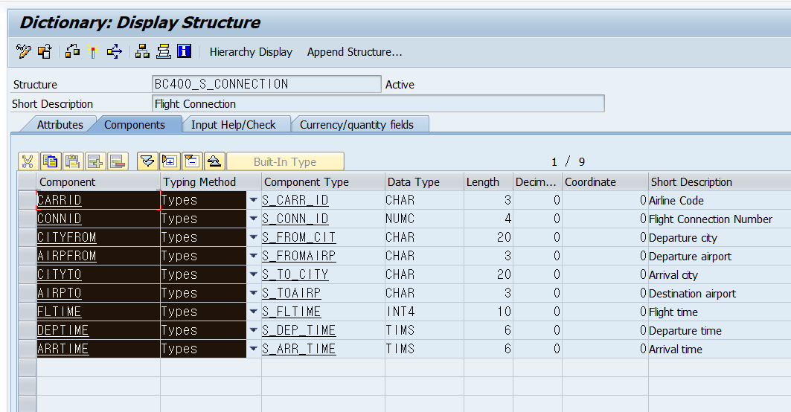
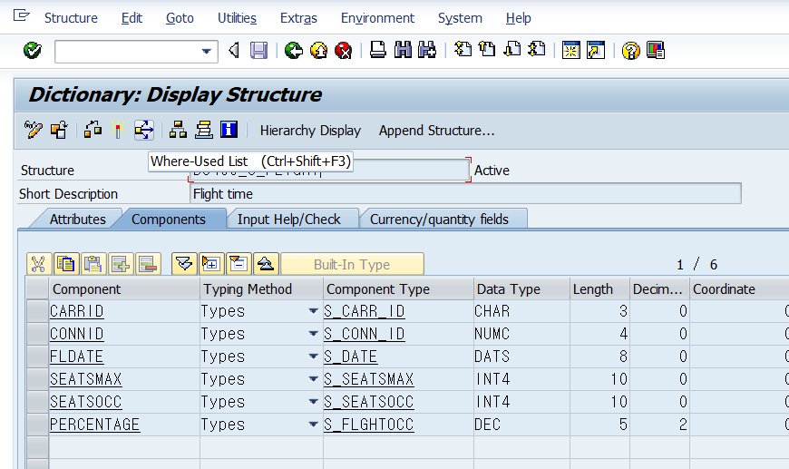

# COMPLEX DATA OBJECT

    아밥 딕셔너리에서 첨포넌트이름을 복사할때는 Crtl+y를 이용할 수 있다.


## STRUCTURED DATA OBJECT
    데이터 타입 선언 방식 동일.  
    데이터 구조는 ABAP Dictionary에서 가져올 수도 있음.

---
### Local structure type 생성
* 타입 선언없이 바로 스트럭처 데이터 변수 선언도 가능하다.  
```abap
    types : begin OF ts_'타입명',
                '필드명'        TYPE '타입명',
                '필드명'        TYPE '타입명',
                '필드명'        TYPE STRING,
            END OF '접두사'_'타입명'.

    DATA: GS_'변수명' TYPE ts_'타입명'.
```
스트럭쳐 내부 요소(COMPLEMENT)를 불러오기 위해서는 '변수명'-'필드명'을 사용하여 값을 출력

```ABAP
    '변수명'-'필드명' = '요소'
```
* 스트럭쳐 변수의 이름으로 식별하여, 다른 스트럭쳐에 값 할당이 가능함.  !!!!!!!!!!!!!!!!!!!!!!!!!!!중요오오오오오오오오ㅗㅇ중
    * 혹은 직접 할당도 가능함
```abap
    MOVE-CORRESPONDING '변수명' TO '변수명'
    '변수명'-'필드명' = '변수명'-'필드명' " Component 직접할당방식
```
 
* 스트럭처 컴포넌트의 이름으로 변수 타입을 복제가능함.
```abap
    data: gs_data TYPE bc400_s_connection.

    PARAMETERS: pa_car TYPE bc400_s_connection-carrid, 
        pa_con TYPE bc400_s_connection-connid.

```
### Debuging Mode 
B2.p397 참고.

---
## INTERNAL TABLE OBJECT
**ARRAY 변수임. DB TABLE이 아님.!!!!**

- N건의 데이터를 처리할 때사용함
- 데이터 크기에 따라 자동 메모리 할당
    * 할당 용량은 시스템에 의존.

---
### **Internal table의 종류**

|구분| Standard|Sorted | Hashed Table|
|---|:---:|:---:|:---:| 
|종류|index|index|Hashed|
|인덱스 접근|가능|가능|불가능|
|KEY 접근|가능|가능|가능|
|KEY Uniqueness|Non-Unique|ANY|Unique|
|Use IN| Index Access| key Access|Only Key|
|SORT| 가능 |SORT 불가||

---
### Internal table 생성

#### Global table 선언
```abap
    DATA gt_tables TYPE '글로벌 테이블 타입명'
```
#### Local table 선언
    스트럭쳐 타입만 있다면 간편하게 로컬 테이블 변수 선언가능   
    스트럭쳐 타입이기만 하면 변수를 이용하여도 테이블 생성이 가능함.

```abap
    TYPES tt_'테이블 타입명'
        TYPE '테이블 종류' OF '컬럼 스트럭쳐 타입명'
        WITH 'Primary 키 설정' '컬럼명' '컬럼명'.

    DATA GT_'테이블명' TYPE '테이블 타입명'.
```
- 예시 
```abap
    TYPES tt_Flights
        TYPE standard table OF ts_flight
        WITH NON-UNIQUE KEY carrid coonid fldate.
```
- 변수와 동시에 타입 선언가능
- 1 * N 테이블도 컬럼 타입에 DATA ELEMENT 타입으로 설정시 선언가능
- 테이블 종류 미입력시 자동 STANDARD TABLE로 설정
```abap
    DATA tt_'테이블 타입명'
        TYPE '테이블 종류' TABLE OF '컬럼 스트럭쳐 타입명'
        WITH 'Primary 키 설정' '컬럼명'.
```  
#### 인터널 테이블 을 이용한 스트럭쳐 데이터 생성
```abap
    DATA: '테이블명' TYPE '테이블 타입명',
          '스트럭쳐명' LIKE LINE OF '테이블명'
```
### Internal table CRUD

| 용어 | 설명 | 문법 |
|:---:|:---|:---|
|APPEND|마지막 Row 밑에 레코드 추가| `APEND '스트럭쳐' TO '테이블명'`|
|INSERT|레코드 추가|`INSERT '스트럭처' INTO TABLE '테이블명' <입력위치> `|
|READ|특정 Row 조회|`READ TABLE '테이블명' INTO '스트럭쳐' <조회 조건> `|
|CHANGE|특정 Row 수정|`MODIFY TABLE '테이블명' FROM '스트럭쳐' [<조건>]`|
|DELETE|특정 Row 삭제|`DELETE '테이블명' <조건>`|  

[Internal table 사용 예시](/ABAP_source_code/week1/Internal_table_example.abap)

#### Internal table 레코드 수정
- DB table이 아니기 때문에 기본적으로 특정 Field만 수정이 불가능하고 해당 Row의 값을 모두 변경해야함.
- Transporting 문법을 사용하면 특정 필드만 수정 가능함. 
    - performance 차이가 큼.

### record 뭉치 관리

| 용어 | 설명 | 문법 |
|:---:|:---|:---|
|LOOP|반복문| `LOOP AT '테이블명' INTO '스트럭처명' <조건>`|
|DELETE|대량 삭제|`DELETE '테이블명' '조건'` |
|INSERT|여러 ROW 입력|`INSERT LINES OF '테이블1'<조건> INTO '테이블명2' <조건> `|
|APPEND|테이블1을 테이블2에 추가|` APEND LINES OF '테이블명1' <조건> TO '테이블명2'` |


### 조회 조건
- 문법상 반복문 조건구문에 where절 사용가능.  
`whre '컬럼명' = '조건' '컬럼명2'='조건2'`
- Read 테이블 조건구문에 WITH TABLE KEY 사용.  
    꼭 Primary key가 모두 작성되야함.
```ABAP
    READ TABLE '테이블명' INTO '스트럭쳐명'
         WITH TABLE KEY '컬럼명' = '조건'
                        '컬럼명' = '조건'.
```
- WITH KEY 구문 사용시 uNIQUE 조건을 요구하지 않음.
```ABAP
    READ TABLE '테이블명' INTO '스트럭쳐명'
         WITH KEY '컬럼명' = '조건'.
```

### 자동 할당
* 스트럭쳐와 같이 MOVE-corr- 문법사용가능
```abap
    MOVE-CORRESPONDING '변수명' TO '변수명'
    '변수명'-'필드명' = '변수명'-'필드명' " Component 직접할당방식
```

### Table Sorting
SQL order by 보다 테이블 소팅이 훨씬 좋음.
```abap
    sort '테이블명'.
    sort '테이블명' by '컬럼명'.
    sort '테이블명' by '컬럼명' Ascending|Descending.
    sort '테이블명' by '컬럼명' Descending
                      '컬럼명' Ascending.
```

### 테이블 삭제
1. `refresh '테이블명'.`
2. `clear '테이블명'.`  
    일반적으로 사용함.
3. `FREE '테이블명'.`  
    메모리에서도 완전삭제.

### TAble Header Line
#### B2.P422
    정상 구문이라면 인터널 테이블과 스트럭쳐 라인을 모두 생성해서 스트럭쳐 라인을 테이블의 Work area로 사용해야하지만,  
     `WITH HEADER LINE.`구문을 이용한다면,
    WORK AREA없이 헤더를 이용하여 테이블 CRUD가능함.

### 스트럭쳐로 테이블 찾기
abap dictionary에서 스트럭쳐 검색하고 
ctrl + Shift + f3 (where is USE) 기능을 사용하면 해당 스트럭쳐가 사용된 데이터 오브젝트 등을 찾을 수 있음.


