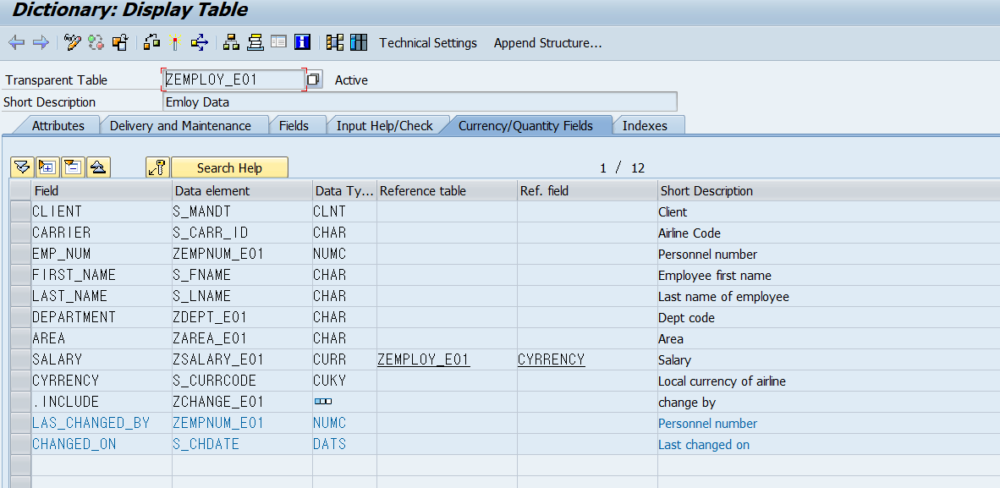

# DATABASE TABLE

    공통적으로 사용되는 Key Field는 Structure로 생성하여 관리할 수 있다.
    ????????????????????????????????????????????????????????
    Key 엔터티를 테이블로 만들어놓고 DB모델링한다는 말인가?

## 주요 T-code
|||
|---|---|
| SE16 | DB Browser|
| SM05 | 로그인 내역 확인|

---
## TRANSPARENT TABLE

Table을 생성하기 위해서는 column (Field)이 필요함.  
컬럼은 Key Field (pk)와 FUNCTION FIELD (일반)로 나눠진다.  

TRANSPARENT TABLE은
SAP에서 DB에 Table을 생성하기 위한 Table Definition.

TRANSPARENT TABLE을 정의하고 Activate하면 DB에 테이블이 생성됨.

---
## TABLE include Structure
    간단히 말해서 정규화 시킨 테이블임.   
    레퍼런스 기능을 포함하고 있음  

## Technical Setting
<B>&nbsp;&nbsp;&nbsp;&nbsp;B3.P60</B>  

    Transparent table을 생성하기 위해서 필요한 설정값.

1. Data base 관련   
    1. data class setting   
    2. size category setting  
        DB용량 확장할 떄 커질 크기
    3. Logging setting  --- Optional  
        테이블 변경이력을 DB에 저장할 것인지?
2. ABAP server 관련
    1. Table Buffer     --- Optional  
        테이블 레코드를 Table Buffer에서 읽어 올것인지?
        sm05

---
### Table Fragmentation
<B>&nbsp;&nbsp;&nbsp;&nbsp;B3.P61</B>  

1. DATA CLASS SETTING  

    조각나있는 DB의 테이블 데이터 메모리를  
    DATA 클래스를 이용하여 카테고리화함.  
    이를 통해 DB에 조각나서 저장되는 영역을 최소화함. 

2. SIZE CATEGORY SETTING  

    DB 저장 용량을 확장할때 자동으로 확장하는 용량을 설정
    0~9까지 설정할 수 있음.  

3. 로그 데이터 세팅    

    데이터 변경이력을 DB에 저장할 것인지 설정

4. TABLE BUFFER    
    UNIT 4에서 실습
    
---
### TRANSPARENT Table 생성 및 설정 실습

아밥 딕셔너리에서 새성

1. ztaddr_e01 테이블 생성    

2. Transparent table Class 설정

    딜리버리 클래스로 DB접근 권한 등을 관리할 수 있음
    디스플레이 브라우저에서 접근 권한도 설정할 수 있음

3. Table Culomn 설정

    첫번째 필드는 무조건 MANDT가 와야함!!!!!!!!!!!!!!!!!!!!!!!!!!!!!  
    MANDT는 클라이언트를 의미함  
    Table 생성시에는 생략이 가능함  
    
    BUT,    
    OPENSQL을 통해 해당 Table 접근할 수 없음.  
    OPEN sql은 DBI를 거쳐 자동적으로 클라이언트를 핸들링 하기 떄문에  

    이렇게 테이블에 접근하기 떄문에 DB테이블에 MANDT   
    즉, 클라이언트 정보가 없을때는 DBI에서 접근할 수 없다.

    키 필드의 경우 이니셜 벨류(NOT NULL;데이터 타입별 초기값 입력)를 자동으로 설정됨.

    필드 작성했으면 테크니컬 세팅을 해야함

4. 다음으로 데이터 클래스 설정
    1. APPL0 &nbsp;&nbsp; : &nbsp;&nbsp; Master Data, Transparent Tables
    2. APPL1 &nbsp;&nbsp; : &nbsp;&nbsp; Transaction Data, Transparent Tables
    3. APPL2 &nbsp;&nbsp; : &nbsp;&nbsp; Organization and customizing
    4. DDIM &nbsp;&nbsp; : &nbsp;&nbsp; Dimension Tables in BW 경영진의 경영판단을 위한 데이터 저장
    5. USER &nbsp;&nbsp; : &nbsp;&nbsp; 직접 만드는 테이블의 경우에 대체적으로 사용

여기서부터 Optional

5. Buffer Setting
대부분 사용하지 않음  
어플리케이션 서버별로 존재하기떄문에 데이터가 정합성에 오류가 있어서 사용하지않음.  

6. 데이터 변경 로그값 저장 설정

만약 테이블에 직접 데이터를 생성하기 위해서는  
ABAP Dictionary에서
Utilities - Table Contents - Create Entries  
를 이용해서 가능함 혹은,  
 Data Browser에서 쉽게 가능함.  

만약 Data Browser에서 Maineanence NOT Allowed로 설정해놓으면,    
SAP 워크벤치에서 테이블 직접 접근이 불가능해짐  

ZTEMPLOY_E01  
테이블 생성  

zs_change_e01  
변경된 사항을 저장할 인클루드 스트럭쳐 생성  

ZTEMPLOY_E01 와 ztaddr_e01 에  
zs_change_e01를 INCLUDE로 삽입해놓음  

앞으로 변경된 사항은 모두 공유됨.  

★★★★★★★★★★★★★★★★★★★★★★★★★★★★★★★★★★★★★★★★★★★★  
Quantaty 혹은 Currency를 관리하는 Column은     
단위를 찾을 수 있는 레퍼런스를 설정해줘야한다.   
위의 예제에서는   
Salary 필드에 대한 Currncy 레퍼런스를 Currency 컬럼으로 설정하면됨.  

  

## CLUSTER TABLE

## POOLED TABLE
