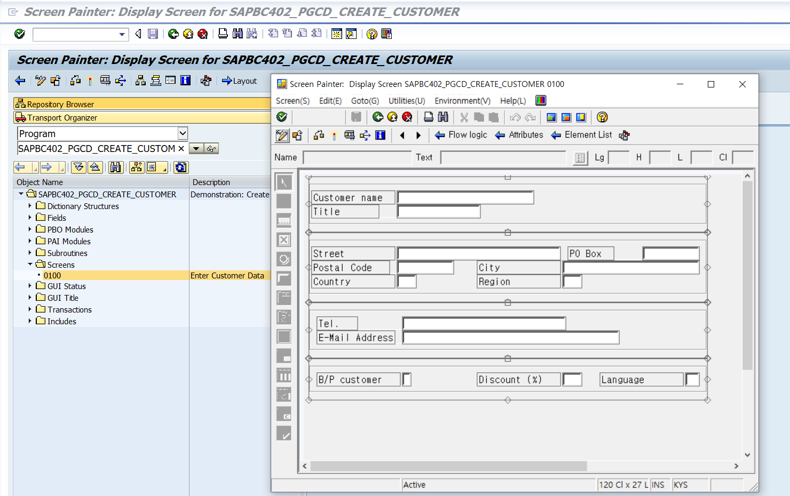
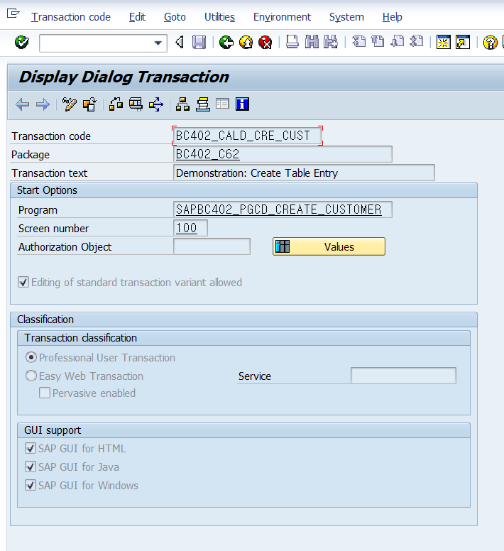

|단축키|설명|
|:---:|:---:| 
|Ctrl + u | 대소문자 변환 |

|T-CODE|설명|
|:---:|:---:| 
|SHDB |트랜잭션 레코딩 |


# Program Analysis Tools


<h2 align = center><b>일단 넘김</b></h2>

---

# Program Call & memory Managament
&nbsp;&nbsp;&nbsp;**B2.P562**  

<p>
    ABAP에서는 복합적인 업무 요청사항을 수행하기 위해<br>
    프로그램을 중첩하여 실행할 수 있다.<br>
    이는 Caliing Program이라고 불리며 크게 두가지 분류가 있다.
</p>

## Syncronous Program Call
1. <b>START NEW PROGRAM</b>  
    진행중인 프로그램을 종료하고 새로운 프로그램을 실행한다.  
    Runing 메모리에서 기존 프로그램은 소거되고 신규 프로그램이 메모리를 차지한다.  
<br> 
2. <b>INSERT PROGRAM</b>  
    진행중인 프로그램을 유지한 채, 신규 프로그램을 구동한다.  
    기존 프로그램이 메모리를 계속 차지하고 있는 상태로 신규 프로그램이 추가적으로 메모리 용량을 차지한다.

## Program Calling
    ABAP의 프로그램 구동은 T-code를 이용한 실행과 프로그램 이름을 통한 직접실행으로 나뉜다.

---
## SYNC Call of Executable Program
&nbsp;&nbsp;&nbsp;**B2.P563**

1. <B>SUBMIT</B> ---- start new Program   <br><br>
    기존 프로그램 종료 후 신규 프로그램 실행 방식  
    따라서 아래 예제의 소스코드 2는 실행되지 않으며,  
    신규 프로그램 종료후에는 모든 프로그램이 종료된다.
```abap
    소스코드1
    submit '프로그램명2'
    소스코드2
```

 ---
2. <B>SUBMIT & return</B> ---- insert Program 방식  <br><br>
    기존 프로그램을 종료하지 않고 신규 프로그램을 실행하는 방법  
    신규 프로그램의 입력값을 기존 프로그램에서 바로 입력받아 출력한다.  
    신규 프로그램 종료 후에 기존 프로그램 소스코드 2의 결과값을 확인 할 수 있다.
```abap
    소스코드 1
    submit '프로그램명2'
        and return
    소스코드 2
```
---

3. <B> SUBMIT via select screen</B> ---- insert Program 방식 <br><br>
    기존 프로그램을 종료하지 않고 신규 프로그램을 실행하는 방법  
    신규프로그램 실행시 Select Screen에서 부터 실행된다.  
    신규 프로그램 종료 후에 기존 프로그램 소스코드 2의 결과값을 확인 할 수 있다.
```abap
    소스코드 1
    submit '프로그램명2'
    via selection-screen
        and return
    소스코드 2
```
---
### <B>Passing Data Using Interface</B>
    구동된 프로그램은 같은 User Session에서 같은 ABAP 메모리를 공유하고 있기 때문에 프로그램 인터페이스를 통해 Value를 교환할 수 있다.
아래 예시를 통해 손코딩으로 작성이 가능하며 PATTTENR 방식으로도 입력이 가능하다.
- 구조
```ABAP
    data '변수명 {TYPE|LIKE} RANGE OF {TYPE|DATEA OBJECT}.
    SUBMIT '프로그램명' 
      AND RETURN
    WITH '파라미터' {=|<>|>|...} '값'
    * 파라미터의 __값을 입력
    WITH 'so_옵션' {=|<>|>|...} '값' SIGN {'I'|'E'}
    * 옵션에 __값을 {I(포함)|E(미포함)}한 조건.
```
- 예시
```abap
    MODULE user_command_INPUT.
    ...
    CASE save_ok.
        WHEN 'CTRYFR'.
            SUBMIT sapbc_tabd_hashed
            WITH pa_city = sdyn_conn-countryfr
            AND RETURN.
```

<hr>

## transaction call
**B2.P566**
1. start new Program BY T-code  
    현재 프로그램 종료 후 트랜잭션 코드 실행
```abap
    Leave to transaction 'T-code'
    [and skip FIrst screen]  " 첫번째 스크린 생략 가능 OPtion
```

2. Insert Progrma BY T-code  
    현재 프로그램 실행을 유지하며 트랜잭션 코드 실행
```abap
    call transaction 'T-code'
    [and skip FIrst screen]  " 첫번째 스크린 생략 가능 OPtion
```

콜링 트랜잭션을 이용해서는 테이블 타입 bdcdata 를 이용해서 데이터 값을 저장하고 활용함.

- 스크린 페인터 활용 


<HR>

## BDC(Batch Data Communication)
**B2.P568**  
**!!!!!!!!!!!!!!!!!!!!!!!!!!!!!다시봐야함!!!!!!!!!!!!!!!!!!!**  

### BDC데이터 구성 요소
**B2.P568** 
|필드명|설명|찾는방법|
|:---:|---|---|
|PROGRAM|프로그램 이름|SY-REPID|
|DYNPRO|스크린 번호|SY-DYNNR|
|DYNBEGIN|BDC화면 시작|'X'값으로 스크린 시작을 알림|
|FNAM|필드 이름||
|FVAL|BDC 필드의 입력된 Value||

>BDC는 사용자가 Macro를 사용하여 SAP 프로그램을 자동으로 수행하는 것과 같은 형태의 기능과 유사합니다.  
물론 CBO에도 BDC를 적용 할수는 있습니다.  
SAP 스탠다드를 사용자가 매크로처럼 100번~1000번 반복 해야할 작업을 BDC 프로그램으로 한번에 실행될 수 있도록 구현하는 프로그램입니다.  

>즉 단순 반복작업을 최소화하여 Background로 수행 가능하도록 해줍니다.  

>여기서 포인트는 사용자가 직접 프로그램에서 정해진 시나리오대로 작업하는 절차를 Recording을 수행하는 것으로 직접 DB Table에 입력하는 것이 아닙니다.  

>실무에서는 반복되는 작업을 중심으로 BDC 프로그램들이 모듈별로 구현 되어 사용 되고 있는데,  

>주로 마스터정보 생성, 변경작업시 BDC프로그램을 사용하고 있습니다.  
현업입장에서 수행해야 할 반복업무가 정규화 된다면 그 프로세스는 BDC로 구현해볼만한 고려 대상이 될 것입니다.  

>BDC로 구현하거나, CBO 프로그램으로 Batch수행할지, 작업자가 수행하지 않아도 자동으로 수행하는 작업은 많습니다.   

### 트랜잭션 레코딩
    bdc데이터에 이용할 DATA벨류를 확인하기 위해 트랜잭션 메모리를 메크로로 확인하는 방법이라고 할 수 있나?

  





!!!!!!**BDC프로그램을 이용해서 데이터 마이그래이션을 진행함.**

[BDC프로그램 예시](/ABAP_source_code/week2/BDCPROGRAM.abap)


---

## memory
**B2.P579**  

ABAP 소스코드는 DB에 3가지 버전으로 저장된다.
1. active version
2. Dev version
3. Gen version 


p586 insert program memory

    SUBMIT 과 LEAVE TO TRANSACTION 프로그램의 차이는  
    인터널 세션 종료와 메모리 초기화면에 있어서 차이점이 있다.
    !!!!!

---
## Runtime Memory Management
&nbsp;&nbsp;&nbsp;&nbsp;**B2.P579**

워크벤치에서 개발한 모든 프로그램과 오브젝트,디스플레이는 DB에 Developed Version으로 저장되고  
실사용 버전인 Generated Version으로 DB에 복사 저장된다.    
만약 프로그램등을 수정하고 Activate를 하지 않는다면,  
  
Inactive버전으로 Tool Area의 모든 부분이 DB에 따로 저장된다.  
Acrive시에는 수정된 부분이 개발 버전으로 이동된다.  

- &nbsp;이때의 <b>Work Flow</b>는
1. Tool Area의 모든 부분이 저장됨 
2. 문법 오류 체크
3. 액티브 버번으로 덮어쓰기
4. 수정된 프로그램을 Generating

SAP 프로그램 메모리 구성  

**B2.P584**
### Inserted Program

### Submited Program

### Transaction CAll (Leave to )
1. 기존 Session 전부 종료    
2. ABAP 메모리 초기화
3. 

###  Aditional Program Group  
**B2.P592**
<p>
    Function, Class 등 메인 프로그램이 아닌 프로그램이 실행된다면  <br>
    메인프로그램 과 연결된 Aditional Program Group이<br>
    각각의 Class 혹은 Function Group별로 생성된다.
</p>

<p>
    Submited 프로그램이 같은 Function Group을 호출한다면,<br>
    각각의 인터널 세션에 같은 펑션그룹이 중복되어 호출된다.
</p>

|메모리|Main<br>Program|Additional<br>Program|
|:---:|:---:|:---:|
||인터널 세션2||
||메인프로그램1|펑션그룹 X <br>혹은<br>class X|
||||
||인터널 세션1||
||메인프로그램2|펑션그룹 X <br>혹은<br>class X|
||||

---

## 인터널 세션 내부 다른 펑션그룹 |

#### 서브루틴의 메모리 셀 사용
    서브루틴은 프로그램 내부 로컬 함수로 느껴질만큼 메인프로그램 메모리 영역을 공유함.

<b>!!!!!!!!!!!!!!!!!!!!!!!!!!!!!엔드유저 편의성 기능일듯!!!!!!!!!!!!!!!!!</b>

### DATA Transfer Option
<b>B2.P596</b>

&nbsp;&nbsp;&nbsp;&nbsp;Internal Session 내부 ABAP Memory를 이용한 데이터 교환  

&nbsp;&nbsp;&nbsp;&nbsp;External Session SAP MEMORY를 이용한 데이터 교환  

&nbsp;&nbsp;&nbsp;&nbsp;SAP Memory는 Field Value이하 데이터만 교환할 수 있다. 


#### ABAP Memory data transfer
&nbsp;&nbsp;<b>B2.P598</b>  

EXPORT IMPORT 구문을 이용하여 Internal session안에서 데이터 교환.

- 예시
```ABAP
    PROGRAM P1 ...
    DATA : GA_SPFLI TYPE SPFLI,
           GT_FLI   TYPE STANDRD TABLE OF SFLIGHT.
    EXPORT
        CONN    = GS_SPFLI
        FLIGHTS = GT_FLI
        TO MEMORY ID 'MY_ID'
    .

    PROGRAM P2 ...
    DATA : GA_SPFLI TYPE SPFLI,
           GT_FLI   TYPE STANDRD TABLE OF SFLIGHT.
    IMPORT
        CONN    = GS_SPFLI
        FLIGHTS = GT_FLI
        FROM MEMORY ID 'MY_ID'
    .
```

[Export 예문](/ABAP_source_code/week2/Export_ABAP_memory.abap)


[Import 예문](/ABAP_source_code/week2/Import_ABAP_memory.abap)

---
#### sap Memory를 통한 데이터 교환
<b>B2.P599</b><br>
<b>External Session간 DATA 교환</b>
- set으로 보내주고
- get으로 가져오고

프로그램 입력 감ㅅ


예시   
[SET Field](/ABAP_source_code/week2/Set_SAP_Memory.abap)  
[GET Field](/ABAP_source_code/week2/Get_SAP_Memory.abap)


---
## 메모리 클리어     23.01.05.
<b>B2.P606</b>

### 일반적인 변수 관리
    
### String 타입 메모리 관리
- String과 XString은 varchar가 기본이다.  
- 이런 데이터 타입을 Deep Data Type이라고 일컬음.

> clear 키워드는 데이터 메모리만 삭제하고<br>
> Free는 메모리 헤더도 삭제한다.

---
### Internal Table 타입 메모리 관리

- DB에서 인터널 테이블에 레코드를 불러오면서 헤더와 데이터 공간이 할당  

- Do 반복문 시행시 헤더는 추가적인 메모리를 포인팅함. 

> clear는 데이터만삭제<br>
 Free는 메모리 헤더도 삭제

### 데이터 복제

### 일반 데이터
- `'변수' = '상수'` Memory Header와 Memory를 할당함.
- `'변수2' = '변수1'` 변수2는 변수1의 Memory Header를 Pointing

문자열 추가 함수
1. `concatenate '변수' '추가할 내용' into '변수'.`
2. && 문자열 연산자로 대신할 수 있다.

데이터 벨류가 변경되므로 헤더와 메모리 영역 모두 새로 할당됨.


#### 인터널 테이블  
<b>B2.P610</b>  
일반 데이터 타입과 동일한데,
인터널 테이블에 APPEND등 과같이 한개의 데이터라도 변경된다면,  
새로운 헤더와 메모리 영역으로 할당.  


---

질문사항 메모리 불러오는 일은 모듈 풀 프로그램에서 사용하는지?
엔드유저 편의성을 위해사용할 것 같은데 IF로 프로그램 구동중이라면 혹은 메모리가 존재한다면 하는 식으로 사용하는지?


---

변수의 일부만 얻고 싶을때
변수 + 포지션(길이)

sy-datum+0(4) 
sy-datum 변수의 처음부터 4개 값을 출력함 

