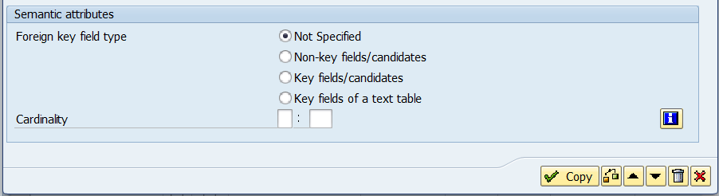

# INPUT CHECK

## Fixed Value
&nbsp;&nbsp;**B3.P120**  

    도메인에 고정값을 선언하여 고정값 내용에 해당하는 것만 입력가능 
    예) 성별 : {남|여}

ABAP Dicc에서 `Domain Display Tab - Value Ranges ` 에서 설정 가능  
고정값을 설정해놓은 도메인을 사용한 DE혹은 Field를 사용해   
INPUT 할 경우에 해당 고정값들만 입력할 수 있음.  

- 예시
```abap
    * Report 프로그램의 경우
    PARAMETERS: pa_class TYPE sbook-class value CHECK .
```
    Domain의 Value Ranges 에 작성된 값 이외의 것이 입력되면  
    오류 Message 발생
- 예시2   
    - ZTEMPLOY_E01(Table Type) - GESCH(Field) - ZeGESCH_E01(DE) - ZDGESCH_E01 (Domain) - Value Tab
    - 해당 도메인에 Single Value 값을 설정하고 설명문을 작성해놓음.


---
## Foreign Key Reference Check
&nbsp;&nbsp;**B3.P126**  

    FK를 이용한 Reference Check
    해당 Record가 유효한 것인치 확인하는 방법
    FK 체크는 APS서버단에서 이루어지기 떄문에 입력 화면에서 바로 확인 가능함

도메인에 Value tab의 제일 하단에서 추천 FK table을 미리 선언해놓을 수도 있음.

1. FK 설정 방법
    - 설정을 원하는 필드를 선택한 뒤 열쇠 아이콘 선택!
    -   
    - 도메인에 Value table을 입력해 놓았다면 추천 FK table을 자동 팝업.  
    - 무조건 도메인에 따라야하는 것은 아니고 상황에 따라 추천 테이블 이외의 것을 사용하라.  

2. FK 적용 후
    - 

---

### &nbsp;&nbsp;Cardinality  
&nbsp;&nbsp;&nbsp;&nbsp;**B3.P133**

- 데이터 관계수를 의미적으로 보여줌
- 의미적 관게이기 때문에 필수가 아님
- 대부분 1: CN의 관계로 설정을 한다고함.




## text table
    코드에대한 텍스트를 다국어로 지원하고자 할때 사용
    번역을 요하는 단어와 그단어를 번역한 언어, 번역한 단어를 테이블로 빼놓은것.

    1:n 관계 RDB Table을 생성힌 것으로 이해하면 됨.
- 예시 ZTORG_E01_T  


