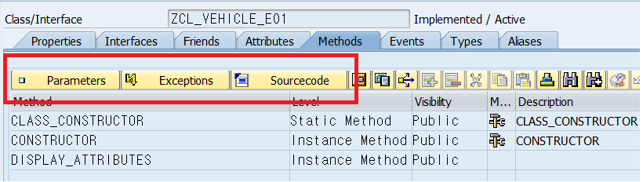
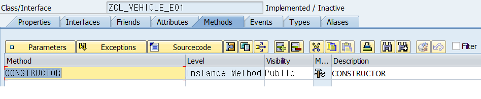
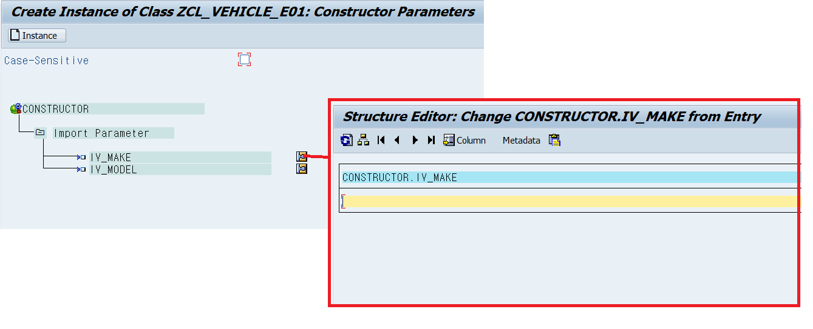
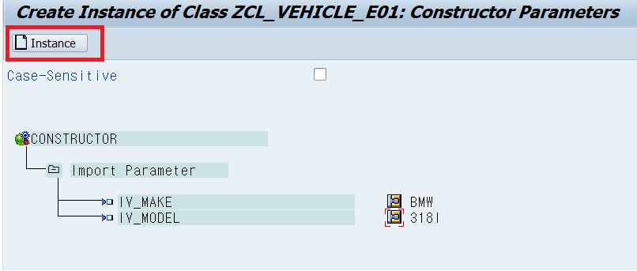
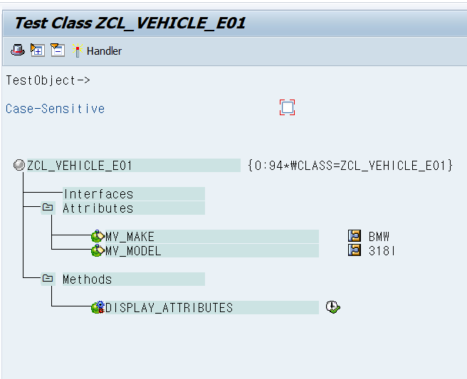
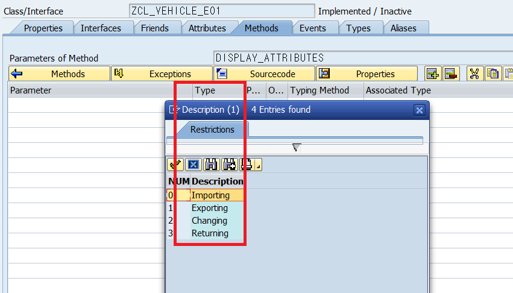

# 글로벌 클래스 생성
&nbsp;&nbsp;&nbsp;&nbsp;P.265

SE-24 | OBJECT CLASS BUILDER
혹은
패키지의 CLASS_LIBRARY에서 생성

## 클래스 접두사 명명법
ZCL_ 혹은 YCL_

## ATTRIBUTE 작성 필요 Field
- 변수명
- LEVE\[선택\]
    - Constants
    - Instance
    - Static
- Visibility\[선택\]
    - Private
    - Public
- Read-only \[checkBox\]
- Associated Type \[필수\]
- Description \[Optional\]
- Initial Value
    - Constants의 경우 \[필수\]

## METHOD
- Method 명
- LEVEL
    - instance Method
    - Static Method
- visibility
    - Public
    - private
- Description \[옵션\]
- 특수한 상황
    - 네비게이션 툴바의 파라미터 버튼으로 해당 메쏘드에 대한 파라미터를 선언한다.
        
    - 컨스트럭터 Method는 Importing Signature만 가질 수 있다.

위의 사항은 다 작성했다면 해당 Method를 더블클릭해서 소스코드를 작성함.

- 글로벌 클래스 생성후 설정화면  
    
- 테스트 최초 실행
    
- 인스턴스 생성
    
- 테스트 완료
    

### 메쏘드에서 인스턴스 사용하는 시그니쳐 설정하기

# 글로벌 인터페이스

# 글로벌 클래스의 상속
