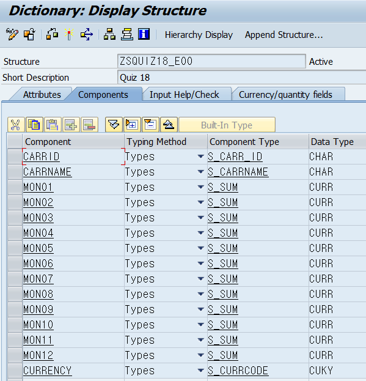

# Dicc DATA 선언

1. 데이터 표시를 위한 Structure 생성
    

# TOP 선언

1. Dicc 데이터 테이블과 워크에어리어 전역 변수로 선언

2. 항공사별 합계 값을 저장할 변수 선언
```ABAP
    DATA :  BEGIN OF gs_pay_group,
                carrid   TYPE scarr-carrid,
                paysum     TYPE sflight-paymentsum,
            END OF gs_pay_group,

            gt_pay_group LIKE TABLE OF gs_pay_group.

```

3. 연도를 위한 파라미터 설정
`PARAMETER : pa_year TYPE pkw_year.  " numc 4자리임`


# EVENT 시작

## INITIALIZATION
1. 입력 연도를 현재 연도로 초기값 설정

```ABAP
    INITIALIZATION.
    pa_year = sy_datum(4)
```

## Start of SELECTION

``` ABAP
    DATA: GT_DATA TYPE TABLE OF ZSQUIZ18_E00,
          GS_DATA LIKE LINE OF GT_DATA.

    * 항공사별 paymentsum total variable.
    DATA: BEGIN OF GS_SUM,
            CARRID     TYPE SFLIGHT-CARRID,
            PAYMENTSUM TYPE SFLIGHT-PAYMENTSUM,
          END OF GS_SUM,
          GT_SUM LIKE TABLE OF GS_SUM.

    * 매월 시작일, 마지막일, 월 처리 변수.
    DATA: GV_BEGDA TYPE DATS,
          GV_ENDDA TYPE DATS,
          GV_INDEX TYPE NUM2.

    * 필드를 동적으로 처리하기 위한 변수.
    DATA: GV_FNAME TYPE STRING.

    * 항공사 코드, 이름 처리 변수.
    DATA: GT_SCARR TYPE TABLE OF SCARR,
          GS_SCARR LIKE LINE OF GT_SCARR.

    FIELD-SYMBOLS: <FS_COMP> TYPE ANY.

    * Selection Screen - Year.
    PARAMETERS: PA_YEAR TYPE PKW_YEAR.


    INITIALIZATION .
      pa_year = sy-datum(4).

    *   항공사 이름 전체 조회
       SELECT * into TABLE gt_scarr
        from scarr.


    START-OF-SELECTION.

      DO 12 TIMES.
    *    *매월 로 지정
        gv_index = sy-index.
    *    *매월 시작일
        gv_begda = pa_year && gv_index && '01'.
    *    *매월 마지막일

    *   해당 월의 마지막 날짜를 가져오는 FUNCTION임!
      CALL FUNCTION 'DATE_GET_MONTH_LASTDAY'
        EXPORTING
          i_date        = gv_begda
       IMPORTING
         E_DATE        = gv_endda
                .


    *    각 항공사 PAYMENTSUM의 합계 데이터 조회

        SELECT carrid SUM( paymentsum )
          INTO TABLE gt_sum
          FROM sflight
          WHERE fldate BETWEEN gv_begda AND gv_endda

    *      항공사 별 묶음
          GROUP BY carrid.


    *   DO 가 돌아가는 횟수가 곧 해당하는 월 이기 에 DO index를 정보 넣기 전에 할당.
        gv_fname = 'GS_DATA-MON' && gv_index.
        ASSIGN (gv_fname) to <fs_comp>.

    *      한개 컬럼에 묶인 데이터를 월별 컬럼으로 이동시키기.
        LOOP AT  gt_sum INTO gs_sum.

          READ TABLE gt_data into gs_data WITH key carrid = gs_sum-carrid.


          IF sy-subrc <> 0.     " 1월 분 처리

            gs_data-carrid = gs_sum-carrid.

            READ TABLE gt_scarr into gs_scarr WITH KEY carrid = gs_sum-carrid.

            IF sy-subrc = 0.
              gs_data-carrname = gs_scarr-carrname.

            ENDIF.

            <fs_comp> = gs_sum-paymentsum.
            APPEND gs_data to gt_data.

          else .

            <fs_comp> = gs_sum-paymentsum.
            MODIFY gt_data from gs_data INDEX sy-tabix.


          ENDIF.

          clear : gs_data, gs_sum.
        ENDLOOP.

      ENDDO.

      CL_DEMO_OUTPUT=>DISPLAY( GT_DATA ).

```