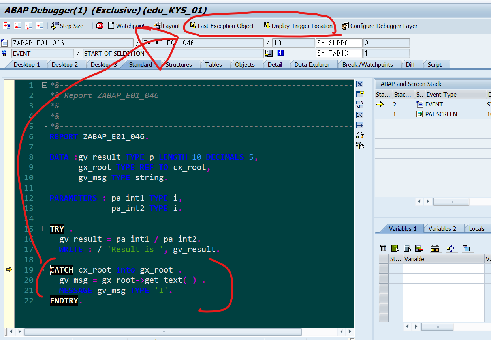
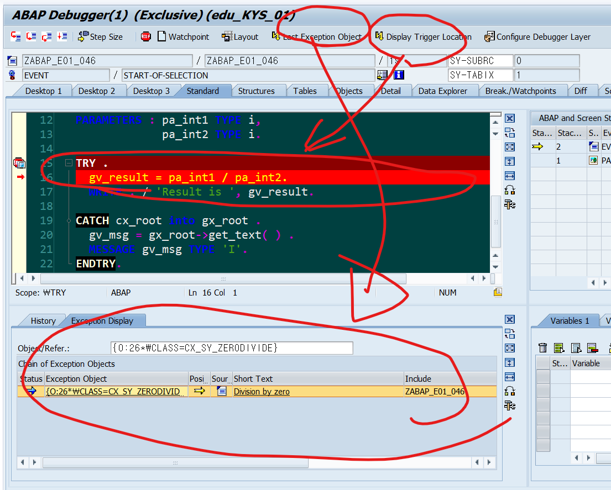

# Exception Class
&nbsp;&nbsp;&nbsp;&nbsp;P.342

## 클래스 접두사 명명법
ZCX_ 혹은 YCX_

## SYNTAX

- 정의
```ABAP
    RAISE EXCEPTION TYPE <zcx_예외클래스명>
    [EXPORTING attr1 = ...
               attr2 = ... ].
```
- 구현은 TRY 문을 통해 실행.
- 모든 EXCEPTION은 CX_root로부터 상속됨.
- CX_ROOT는 IF_MESSAGE의 GET_TEXT()를 포인팅

## HANDLING
```ABAP
    TRY.

    기본 실행 구문

        CATCH CX_<final level> Cx_<그 다음 level> cx_<상위 레벨> [INTO <예외 오브젝트> ].

        ...

        CATCH CX_<예외명> [INTO <예외 오브젝트> ] .

        * 예시구문
        GV_TEXT = GX_EXC->GET_TEXT( ).
        MESSAGE GV_TEXT TYPE 'I'.

        CLEANUP.

        ...

    ENDETRY.

```



---

실습 
ZABAP_E01_046

--- 