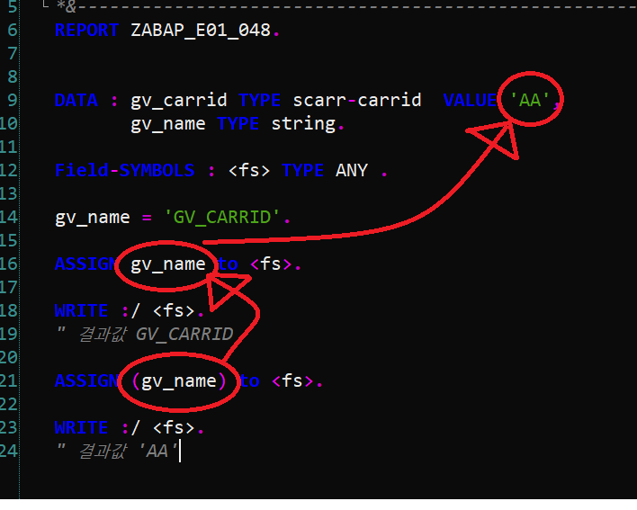

# Generic Data Types
&nbsp;&nbsp;&nbsp;&nbsp;p.478
    이해만 한다면 복잡한 프로그램을 간단하게 만들수 있다.

## 데이터 타입
|Generic Data Type| 설명 | ABAP 타입과비교 사항 |
|---|---|---|
|`ANY`<BR>`DATA`|모든 데이터 타입과 연결 | 
|`SIMPLE`| 모든 엘리먼트 데이터 타입 또는 캐릭터 스트럭쳐| 모든 ELEment 타입과 character like Structure|
|`NUMERIC`<br>`DECFLOAT`|
|`CLIKE`<br>`CSEQUENCE`|
|`XSEQUENCE`|

---
## 테이블 타입
|Generic Data Type| 설명 | 비교 사항 |
|---|---|---|
|`ANY TABLE`     |||
|`INDEX TABLE`   ||스탠다드 또는 소티드|
|`STANDARD TABLE`|||
|`SORTED TABLE`  |||
|`HASHED TABLE`  |||

실습
ZABAP_E01_046


# Field Symbol

- 적절한 GENERIC DATA TYPE을 이용하여 형변환을 자유롭게 사용하는    
  특별한 변수를 선언할 수 있는 방법이 있다.

- 동적인 데이터 처리를 위한 방법이다.

- C의 Pointer와 유사한 기능이다.


문법

```ABAP
    FIELD-SYMBOLS :
        <fs_tab> TYPE ANY TABLE.   " 필드 심벌의 선언

    CASE gv_table_name.
        WHEN 'SCARR'.
            ASSIGN gt_scarr to <fs_tab>. " 필드 심벌을 통해 다른 데이터를 포인팅

        WHEN 'SBOOK'.
            ASSIGN gt_sbook to <fs_tab>.
    ENDCASE.

    IF <fs_tab> IS ASSIGNED.             " 뭐가 됐던 다른 데이터를 포인팅 중임.
                                         " 반대 구문은 IS NOT ASSIGNED 
        SELECT * FROM (gv_table_name)    " 괄호 사이에 공간이 있으면 안된다.
        UP TO 100 ROWS
        INTO TABLE <fs_tab>.
    ENDIF.

```
---
실습
ZABAP_E01_047

---

## Type Casting With Field Symbols
&nbsp;&nbsp;&nbsp;&nbsp;p.484

필드 심벌을 이용해서  형변환이 필요 할떄에는 CASTING을 이용한다.

```ABAP
    


```

## Dynami Access to Data Objects

```ABAP
    gv_name = 'GV_CARRID'
    ASSIGN (gv_name) to <fs>  " 'GV_CARRID'를 포인팅한다.
    ASSIGN gv_name to <fs>  " gv_name을 포인팅한다.
```



---

```abap

    gv_name = 'GV_CARRID'.
   
    ASSIGN gv_name TO <fs>.
    WRITE :/ <fs>.                          " 결과값 GV_CARRID
 
    ASSIGN (gv_name) TO <fs>.
    WRITE :/ <fs>.                          " 결과값 'AA'

    gv_name = 'LS_SCARR-CARRNAME'.

    ASSIGN (gv_name) TO <fs>.
    WRITE: / <fs>.                          " 결과 값 : ls_scarr 스트럭쳐의 carrname 컴포넌트의 값.

    gv_name = 'CARRID'.

    ASSIGN COMPONENT gv_name
      OF STRUCTURE ls_scarr TO <fs>.
    WRITE :/ 'Carrid : ' , <fs>.
                                            " 결과 값 : ls_scarr의 'CARRID' 컴포넌트의 값.
    ULINE.

    ASSIGN COMPONENT 4
      OF STRUCTURE ls_scarr to <FS>.
    WRITE : <fs>.
                                            " 결과 값 : ls_scarr의 4번째 컴포넌트의 값.

    ULINE.
```


# GEneric type data refernce

제네릭 데이터 타입은 디레퍼런싱이 불가능하다.

하지만 필드 심볼을 사용한다면 레퍼런ㅅ 벨리어블이 포인팅하는 실제 데이터를 포인팅할 수 있다.


```ABAP
    data :
          gv_int TYPE i VALUE 15,
          gv_date TYPE d.
    gv_date = sy-datum.
    DATA :
          gr_int TYPE REF TO i,
          gr_date TYPE REF TO d,
          gr_gen TYPE REF TO data.

    *&---------------------------------------------------------------------*
    *&
    *&
    *&---------------------------------------------------------------------*

    GET REFERENCE OF gv_int INTO gr_int.
    WRITE :/ ' gr_int : ' , gr_int->* .
    gr_gen = gr_int.
    * any 타입에 i타입을 입력
    gr_int ?= gr_gen.
    * 현재 int인 generic 타입에 int를 DOWNCAST해도 문제가 발생하진 않는다.

    get REFERENCE OF gv_date into gr_date.
    WRITE :/ ' gr_date : ' , gr_date->* .

    gr_gen = gr_date.
    WRITE :/ gr_gen->*. " 디레퍼런싱이 불사능함ㄷ,


    *gr_int ?= gr_gen.
    * gr_int 는 정수 타입, gr_gen은 현재 date 타입
    * date 타입에서 정수 타입으로 DOWNCAST한다면 오류가 발생한다.
```


# RUNTIME 중에 DATA TYPE과 OBJECT 생성
&nbsp;&nbsp;&nbsp;&nbsp;P.529

일단 오브젝트를 생성하기 위한 레퍼런스 베리어블이 존재하다면,

`go_<레퍼런스 변수> = new  #( <시그니쳐_이름> = '전달할 값' ) .

만약 상속한 SUBCLASS가 존재하다면 서브클래스의 오브젝트로 생성할 수도 있다.

`go_<상위_레퍼런스_변수> = new  <하위_클래스>( <시그니쳐_이름> = '전달할 값' ) .

따라서 하위 클래스에 대한 오브젝트를 동적으로 생성하고자한다면,

<하위 클래스> 부분을 동적으로 변경시킬 수 있으면되는데,

```abap
  gv_class_name = 'CL_RENTAL',
  gv_instance_name = '렌탈 회사 이름'

  CREATE OBJECT go_partner TYPE (gv_class_name)
    EXPORTING 
      iv_name = gv_instance_name.
```


## 동적인 DATA 접근

```ABAP
    DATA : gr_data TYPE REF TO data.

    FIELD-SYMBOLS : <fs_itab> TYPE ANY TABLE .

    PARAMETERS : pa_tname TYPE dd09l-tabname,
                pa_cnt TYPE i DEFAULT 50.

    at SELECTION-SCREEN .
      select count(*)
        FROM dd09l
        where tabname = pa_tname.

      IF sy-subrc <> 0 .
        MESSAGE 'Wring table name ' type 'I'.
        clear : pa_tname, pa_cnt.
      ENDIF.

    START-OF-SELECTION.
      CREATE DATA gr_data TYPE TABLE OF (pa_tname).
      ASSIGN gr_data->* to <fs_itab>.

      SELECT * into table <fs_itab>
        up to pa_cnt rows
        from (pa_tname).

    cl_demo_output=>display( <fs_itab> ).
```

ABAP Dicc 에서 생성 한 모든 데이터 테이블은 `DD09L` 테이블에 자동적으로 등록된다.!!!!!!!!!!!!!!!!!!!!!!!!!!!!!!!

