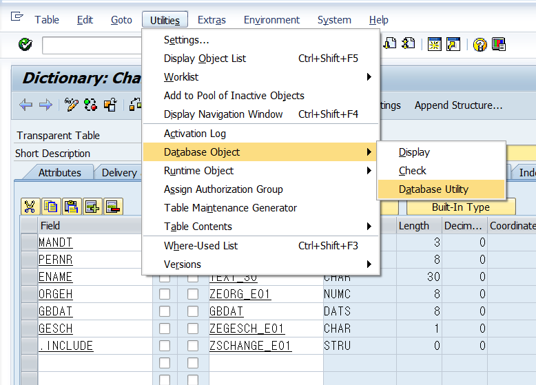
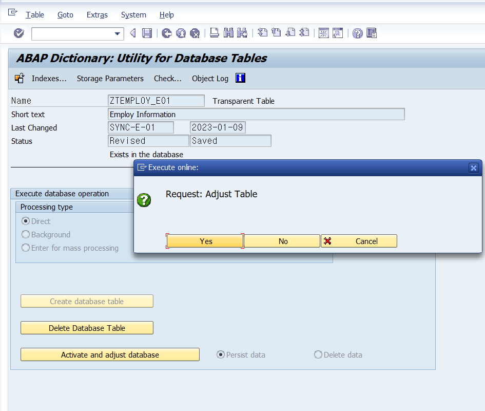

# Dictionary Object

## Active and inactive Dictionary Object 
**&nbsp;&nbsp; B3.P160**  
abap DIcc또한 Server를 통해 운영되기때문에,  
개발자 클라이언트의 Inactive버전은 다른 클라이언트에서 사용할 수 없다.

---
## Identifyieng Dependencies with ABAP DICc
###  **&nbsp;&nbsp;Where-Used list**  
**&nbsp;&nbsp;&nbsp;&nbsp;&nbsp; B3.P170**  

<table>
    <th>T-code</th>
    <th>기능</th>
    <tr>
        <td align = 'center'>SE84</td> 
        <td>Repositary information system</td>
    </tr>
    <tr>
        <td colspan =2>
                ABAP DICC에서 확인할 수 있으며,  해당 TYPE이 사용되는 모든 데이터나 프로그램등을 찾을 수 있는 기능.
        </td>
    </tr>
    <tr>
        <td colspan = 2>아밥 딕셔너리의 변경, 사용리스트 등등의 정보를 찾을 수 있음</td>
    </tr>
</table>

---
# TABLE CHANGE

<b>테이블의 설정을 변경하고자 할때 고려할 수 있는 방법들</b>

1. 해당 테이블을 삭제하고 다시 생성하기 
    - 테이블 내부 정보가 전부 삭제되는 것이 문제

2. ALTER TABLE

3. CONVERT TABLE
    - 예시  
    char60인 필드를 CHAR30으로 컨버젼한다면
        1. 해당 테이블에 락이 생기고  
        테이블 앞에 QCM 접두사가 붙음
        
        2. 인덱스가 전부 사라짐
        
        3. 변경 버전의 테이블이 새로 생성됨

        4. 신규 테이블에는 QCM8이 접두사로 붙음
        
        5. 신규 테이블에 Primary INDEX가 생성됨.
        
        6. 기존 테이블의 내용물을 신규 테이블에 복사함
        
        7. 기존 테이블을 Truncate
        
        8. 신규 테이블 접두사를 삭제하고,  
           기존 인덱스 이름을 변경하여 재설정
        
        9. 테이블 LOCK 해제

- 발생 가능한 문제점   
    - DUMP메시지를 보고 오류 수정하면 된다!            
    1. 테이블 용량에 OverFlow 가능성이 있음.  
    2. 변경되는 컬럼의 손실이 있을 수 있다.   
    3. 타입이 변경될 경우 오류 발생 가능성    

    <b>Converting Adjustment 'Delete Data'</b>  
    만약!!!!!!!!!!!!!   
    convert 옵션을 DELETE DATA로 설정하면 
    모든 클라이언트 테이블 내용이 삭제된다! 
    매우 주의 요함!!!

---
## APPEND Structure A.K.A. Enhancement
**&nbsp;&nbsp; B3.P194**  

    <b>Global Standard Table에 CBO 필드를 추가할 때 사용하는 방법</b>

1. APPEND STRUCTURE의 이름은 Y또는 z로 시작돼야하고,
2. Component의 이름은 zz 혹은 yy로 시작해야한다.
3. Activate하면 DB에 추가된다.
4. APPEND STRUCTURE 한개의 테이블에만 추가가 가능하다!

### **SAP SYSTEM이 UPGRADE된다면**

 
    CBO 필드가 존재하는 상태에서 System 업데이트로 기본 Field가 추가된다면. 
    새로운 기본 필드가 자동으로 해당 table의 CBO필드 뒤에 추가된다.   

    만약!!!!!  
    CBO 필드이름을 규칙에 따라 만들지 않았다면, 
    충돌이 발생할 수 있다. 

### **Enhancement Check**

    <b>Enhancement 이후에는 Table 변경에 따른 영향을 확인해야한다.</b>

1. Where-useed-list로 해당 테이블을 사용하는 프로그램을 찾기
2. write 구문을 통해 신규 필드 적용 내역을 확인한다.  

    만약 모든 스트럭쳐의 컴포넌트가 CHAR일 경우에  
    `write / wa_char` 를 실행하면 해당 스트럭쳐의 모든 내용이 Display 됨.  
- 예시 <a href = "ABAP_source_code\Week3\zabap_e01_029.abap">**ZABAP_E01_029**</a>    
    만약 char TYPE이 아닌 다른 TYPE이 온다면 해당 구문은 사용 불가!

### **append structure 실습**

1. 아밥딕셔너리에서 페어런트 테이블 디스플레이  
    F5 혹은 goto - APPEND STRUCTURE 클릭   
    **ZASTR_E01**을 생성하여 작성   

  
    
- append structure도 ABAP 프로그램에서는 스트럭쳐 타입인 변수로 선언할 수 있다.

---
<b>Exercise 14 B3.P201</b>

---
### Modification

<b>정의 : SAP 기본 테이블의 구성을 수정하는것</b>   
기본 테이블의 구조를 유지하고 필드를 추가하는   
Enhancenment와는 차이가 있다.