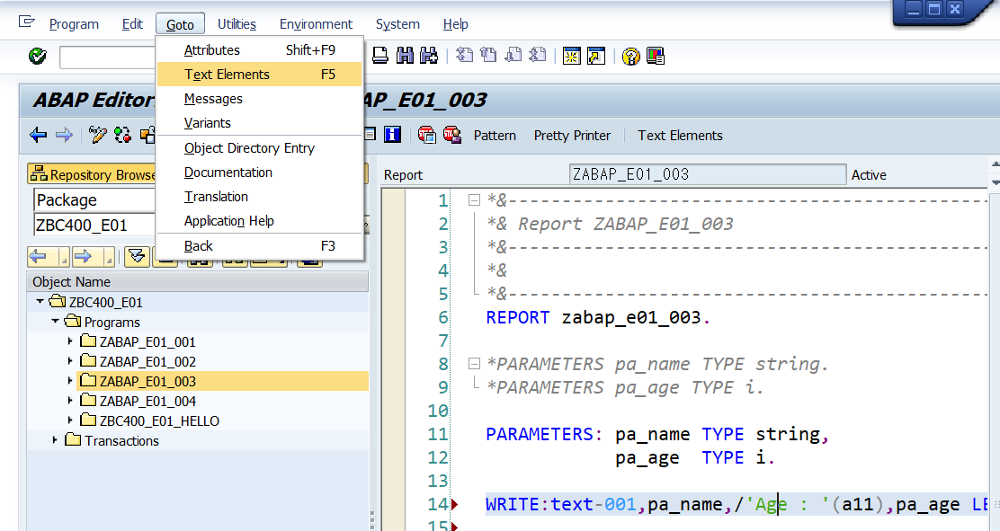
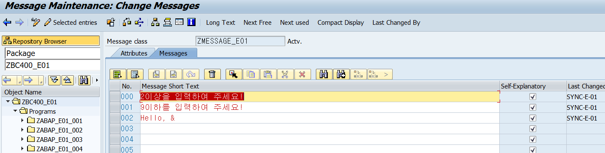
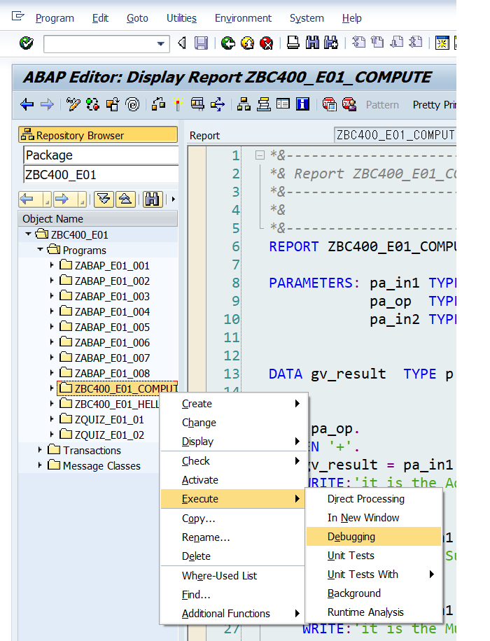

# **ABAP Language Elements**

## 함수

### 숫자형 함수
- abs( 숫자형 ) : 절대값 반환
- sqrt( 숫자형 ) : 루트처리

### 문자열 함수
- strlen( 변수명 ) : 문자열 길이 반환

### 시스템 변수
##### B1. P263
DOC에서 system fields를 검색하면 시스템 데이터 확인이 가능함.
| 변수명 | 설명
|:---:|:---|
| sy-tabix | 루프문에서 사용하는 테이블 인덱스를 반환  |
| sy-dbcnt | select 반복문에서 데이터 테이블 사용량을 반환 |
| sy-mandt | 로그인 클라이언트 |
| sy-uname | 로그인 유저 이름 |
| sy-langu | 로그인시 선택한 언어 |
| sy-datum | 시스템 날짜 |
| sy-uzeit | 시스템 시간 |
| sy-tcode | 현재 티코드 반환 |
| sy-repid | 현재 프로그램의 이름 |
| sy-index | 현재 반복문의 반복횟수 |
| sy-subrc | 현재 프로그램이 정상 시행 중이지 않다면 0 반환 <br> B1.P264에서 확인가능 예시 ) select --where -- 검색 데이터가 없을때 sy-subrc = 0값으로 입력됨.|
    


## B1.P245

### Standard Types of ABAP DATA Elements
#### Complete | 메모리가 정해져있음;Len의 기준은 Byte 
|타입|속성||
|:---:|:---|:---|
| ANY | 모든 데이터 타입을 적용가능함.|런타임 도중 데이터 타입 충돌이 생길 가능성이 있음.|
| D | DATE TYPE;YYYYMMDD'length 8|
| T | time;HHMMSS;length 6|
| I,INT8 | integer; length :4,8;|
| F | floating number; length 8|
| Deep Type | 동적 메모리 할당|
||STRING | dynamic length |
||XSTRING | length byte squence(Hexadecimal string) 16진수|
| DECFLOAT16<br>DECFLOAT34 | Decimal Foating point| 소수점 자리는 각 숫자에 맞춰서 고정|
### Incomplete ABAP Standard DATA type
    Incomplete : 메모리가 정해져있지 않음  
    그래서 길이를 지정해줘야함

- C : 문자열
- N : 숫자이지만 문자로 간주
- X : byte Sequence 16진수 문자열
- P : Packed number;소수점 자리를 지정해서 사용 가능함.  
    팩트넘버 타입을 변수 선언하면 총길이는 Lenth * 2가되지만  
    실제 사용가능한 메모리는 (2L-1)이다.  
    왜냐면, 메모리 마지막에 음수인지 양수인지 표현해주는 자리임.<br>
`types AA type P length 3 decimas 2.`<br>
    최대값 999.00 최소값 -999.99<br>
    표현되기로는 99900+  / 99999-<br>
    실무에서는 소수점 표현시에 팩트넘버를 대체적으로 사용한다.


### 데이터 타입 선언 가능
- **TYPES 변수명 TYPE 비지정데이터 타입 [ LENGTH 숫자]**
- **TYPES 변수명 LIKE (기존 데이터 타입 변수명)**

```abap
    TYPES tv_c_type TYPE C LENTH 8.
    " tv_c_type 데이터 타입은 c:문자열이며 길이는 8이다.
    Types tv_b_type like Tv_c_type.
    " tv_c_type 데이터 타입의 설정을 복사하여 tv_b_type에 적용.
```

 ### ABAP DICTIONARY
    전역변수로 사용가능한 타입으로 딕셔너리에 저장이 가능하다

#### 전역 변수의 종류
- Data elements
- Structure 
- Table Type 인터널 테이블 타입


### 변수 선언 규칙
|접두사|속성|위치|
|:---:|:---:|:---:|
| G | Global data|변수범위
| L | Local data|변수범위
| V | Element Variable|데이터 타입
| S | Structure Variable|데이터 타입
| T | Internal Table|데이터 타입
| C | Constant |데이터 타입

#### 변수의 접두사
    변수선언시 T-code와 마찬가지로 접두사 규칙이 있다.

|접두사|설명||
|:---:|:---|---|
| gv_ | 전역 엘리먼트 변수 |
| lv_ | 로컬 엘리먼트 변수 |
| gs_ | 글로벌 스트럭쳐 변수 |
| ls_ | 로컬 스트럭쳐 변수 |
| gt_ | 전역 테이블 변수 |
| lt_ | 로컬 테이블 변수<br> |
| sy- | 시스템 필드를 의미함 |
|    | SY-DATUM | 시스템 현재 날짜|


### 변수선언
- DATA 변수명 TYPE 타입명.
    - 타입명에는 로컬 데이터타입, 글로벌 데이터타입(아밥딕셔너리), SAP 기본 데이터 타입도 생성 가능함.

- DATA 새로운변수명 LIKE 기존변수명.
    - 기존변수명의 데이터 타입을 복제해서 사용함.
    - 무조건 이 변수 이전에 생성되어있어야함.

- [value "디폴트값"] 
    - 해당 변수에 기본 값을 지정가능
    - 기본 값은 해당 변수에만 지정되고 LIKE을 통해 레퍼런스를 복제하더라도 디폴트값도 복제되지 않는다.

### 상수선언가능
```abap
    Constants 상수명 type 타입명 Value (수 혹은 문자열)
```
## B1.P253 Text symbols
    다국어 사용자를 지원하는 sap에 최적화된 기능
    설정한 단어를 여러언어로 자동 번역함.  

**사용법** : abap 에디터에 텍스트 엘리먼츠에서 설정가능함.  
Menu - Goto- Translate
**중요!!!! 텍스트 심벌도 엑티브 해야함!!**

```ABAP
    WRITE:text-001,pa_name,/'Age : '(a11),pa_age.
```



    위와 같이 원하는 위치에 'TEXT-XXX' 혹은 문자열 뒤에 (XXX)를 입력하여 Text Symols 설정 가능.
    XXX에는 숫자,영문이 사용 가능함.


### B1.P254 로컬 데이터와 글로벌 데이터
    로컬 데이터 타입은 기술적 속성만 부여가능하지만, 
    전역 데이터 타입은 기술적 속성과 의미도 부여가능함


- 지역 데이터 타입은 데이터 종류와 default값, 길이와 같이 기술적인 속성을 설정 할 수 있는 반면, 

- 전역 데이터 타입인 S_carr_id 는 항공사 콜싸인 데이터 타입이며, 어느 프로그램 혹은 클래스에서 사용되는지  확인할 수 있다.

### 변수 값 설정
- A = B : 변수A에 B값을 적용.
- MOve A to B A변수의 값을 B변수에 적용.
- Clear :  변수 비우기.


## B1.P257 산술연산자
- 기본 사칙연산은 똑같음.
- DIV : 몫만 나옴 = //와 같음
- MOD : 나머지만 나옴 = %와 같음


## B1.P260 조건문
### 논리연산자
> and,or,not,>,<,=,is not 등등 사용가능 
- EQ  =  ; 동등함
- LT  <  ; 미만
- GT  >  ; 초과
- LE <=  ;이하
- GE >=  ;이상
- NE <>  ; 같지않음
- Initial = 초기 상태를 의미
  - string의 경우 NULL
  - Integer의 경우 0
- DATA between A and B 사용 가능

1. **IF 조건문**
```ABAP
    IF "조건"
        ... .
    elseif "조건" .
        ...
    else .
        ...
    endif.
```
2. **CASE 조건문**
    단일 조건하에서 단순한 조건문에 사용.
```ABAP
    case ... .
        when "조건"
            ... .
        when others.
            ... .
    end case.
```


## B1.P262 반복문

1. DO 조건문
```abap
    Do. 
        ...
    IF "조건". exit. endif.
    enddo
```    
2. DO N Times 조건문  " N에는 변수도 들어올 수 있음.
```abap
    do N times 
        ...
    end times
```
3. WHILE 조건문
```abap
    while "조건"
        ...
    endwhile
```
4. SELEcT 조건문
```abap
    select ... FROM \<DBTAB\>
        ...
    endselet
```
5. LOOP 조건문
```abap
    Loop at <INTERNAL TABLE>
        ...
    end loop
```
- SY-INDEX 함수를 이용하여 반복문의 반복 횟수를 확인 가능함
- LOOP조건문의 경우 sy-tabix 를 사용하고 FOR I IN \<ARRAY> 와 같은 느낌
- SELECT 조건문의 경우 sy-dbcnt를 사용함

## B1.P270
    유저에게는 메시지라는 키워드로 정보가 표현됨.
    메시지에는 6개 타입이 존재함.

>실무에서는 SWEI를 가장 많이 사용함.

|약어 |설명|출력위치|
|:---:|:---|:---:|
| I | info Message : 단순 알림 메시지 출력 | 팝업창|
| S | set Message : 통칭 석세스 메시지라고 불림. | status bar|
| W | warnig 원인메시지라고 불림 | status bar |
| E | Error 에러메시지 | status bar |
| T | Termination  | 팝업창 |
| X | Short Dump 런타임 에러시 발생됨. | 오류 상태창(SHORT DUMP) |
    
    메시지는 메시지 클래스에서 관리되고 패키지에서 생성가능
    메시지클래스 이름도 z나 y로 시작해야함
```abap
    MESSAGE Tnnn(message_class) [with v1 [v2] [ v3 ] [ v4  ]]  
    
    MESSAGE i000(zmessage_e01).
```
    최대 4개의 변수를 이용해서 메시지 출력에 변환을 줄 수 있음.
    '"변수명"이 사용중입니다.'와 같이 표현할때 변수를 사용함.
    만약 메시지 클래스에 &기호를 사용했다면,



    MESSAGE i002(zmessage_e01) WITH pa_name.
     & 기호 자리에 같이 디스플레이됨.

    다중 변수 사용시에는 아래와 같음
```abap
    MESSAGE i003(zmessage_e01) WITH sy-mandt sy-uname sy-langu sy-datum.
```

    로컬에서 메시지 생성도 가능함
    MESSAGE '2이상을 입력해주세요.' type 'I'.
    타입에는 무조건 대문자가 와야함

    프로그램 레포트 뒤에 메시지 클래스를 등록할 수 있음.
    `REPORT ZQUIZ_E01_02 MESSAGE-ID zmessage_e01.`
    문서 내부에서 메시지 클래스를 선언하지 않아도 됨.
    But, 2개 이상의 메시지 클래스를 사용할 수 없음.

    메시지 클래스는 동일하지만 일시적으로 형태 변환하여 출력할 때에는 displat like 옵션을 사용함.
    `MESSAGE i001 DISPLAY LIKE 'E'.`
    

## B1.P272 디버거
### 디버거 접속방법
1. 브레이크 포인트 설정
2. 디버그 모드로 실행

3. 셀렉션 스크린에서 커맨드 입력 창에 /h를 입력

- 데이터 변수 선언부, 조건문 조건 부분은 BP 설정이 불가능하다.
- 디버그 모드에서 변수를 직접 변경할 수 있다.
- 상수는 디버그모드에서 변경할 수 없다. **B1.P277**

### Call Stack
    디버그 모드 상에서 이벤트 상황을 보여주는 창.


### 디버그 모드 단축키
1. F5 : 다음 줄 실행
2. F6 : 다음 서브루틴 즉시 실행
3. F7 : 서브루틴 탈출
4. f8 : 다음 BP까지 실행, 다음 BP가없다면 끝까지 실행