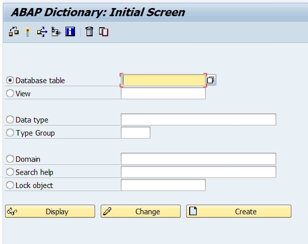
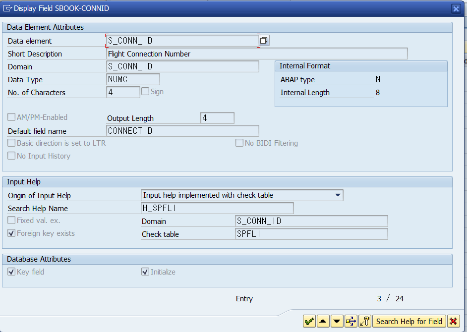
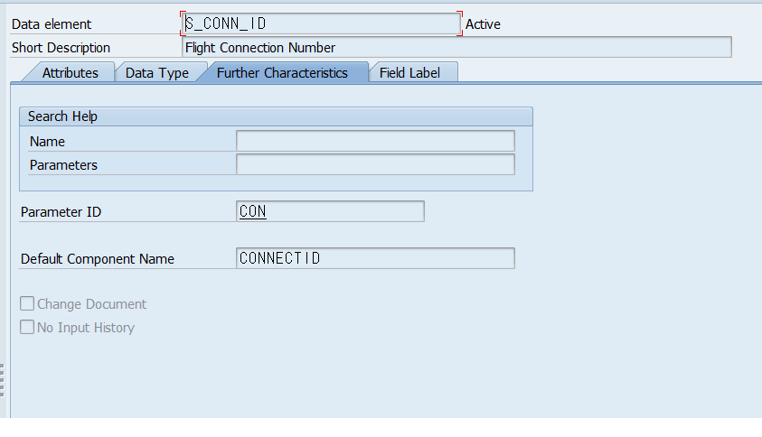
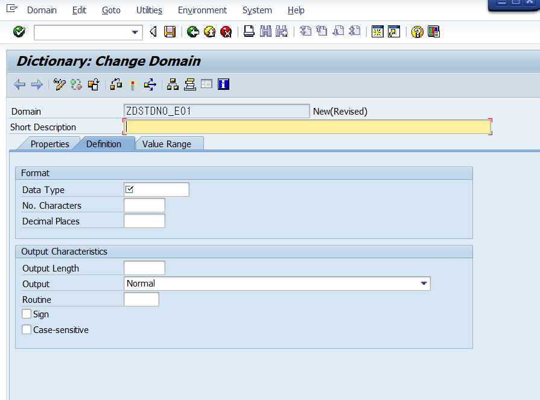
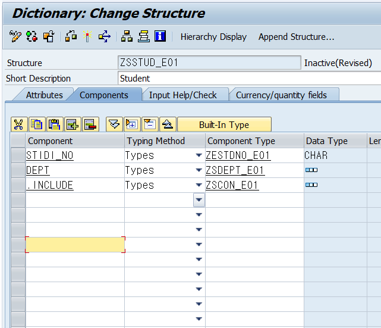
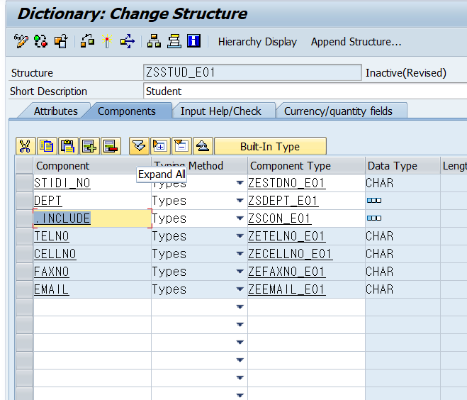
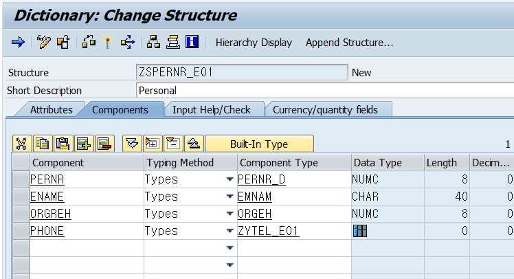

# ABAP DICTIONARY

<h2 align =center> ABAP Dictionary에서 할 수 있는 일.</h2>


1. DB에 테이블 생성

2. DB에 View 생성
    - Database View

    - Projection View

    - Maintenance View

    - Help View

3. Data Type(Global) 생성
    - Data Element

    - Structure 

    - Internal Table

4. Domain - Data Element에서 사용
5. Search Help를 생성(F4 HELP)

---

## Describing ABAP Dictionary  
<B>&nbsp;&nbsp;&nbsp;&nbsp;B3.P1</B>  

1. Global DATA type을 생성할 수 있음.
2. DB에 테이블을 생성할 수 있음.
3. F4 Help를 입력했을 때, 입력가능한 목록표를 출력해주는데,  
   Possible Value 혹은 Possibe Entry라고 말하고  
   이 목록표를 생성할 수 있음.

### View

<p>
    &nbsp;&nbsp;&nbsp;&nbsp;ABAP Dictionary에서 view를 생성하거나 수정하면<br>
    &nbsp;&nbsp;&nbsp;&nbsp;DB에 Table view가 자동적으로 생성됨.<br>
    &nbsp;&nbsp;&nbsp;&nbsp;이러한 view를 통해 DB의 테이블을 수정할 수 있고 조회할 수 있음.
</p>

<p>
    &nbsp;&nbsp;&nbsp;&nbsp;Structure의 Component의 Type으로는 꼭 Data Elements만 올 수 있는 것이 아니다.<br>
    &nbsp;&nbsp;&nbsp;&nbsp;즉, Structure 내부 구성품에 Structure 타입과 인터널 테이블도 올 수 있다.
</p>

---

### 서비스 기능

&nbsp;&nbsp;&nbsp;&nbsp;F1키 F4키로 보여지는 설명문은 아밥 딕셔너리에서 생성할 수 있음.

&nbsp;&nbsp;&nbsp;&nbsp;ABAP 소스코드와 Tool을 이용할 떄,<br>
&nbsp;&nbsp;&nbsp;&nbsp;데이터가 정합한지 Type Definition을 ABAP Dictionary에서 확인하고

&nbsp;&nbsp;&nbsp;&nbsp;DBI에서 DB에 접근하기 위해 OPEN SQL을 SQL로 번역할 때  
&nbsp;&nbsp;&nbsp;&nbsp;ABAP Dictionary를 참고한다.  

---

<h3 align =center><b>ABAP Dictionary 실습</b></h3>




1. 상단 2개가 DB및 뷰 관리 부분
2. 중간 2개가 DE부분
3. 아래가 3개가 서비스 부분

---

Domain과 DATA Elements는 1:N의 관계임  
하나의 Domain은 여러 Data Element의 기술 속성으로 사용될 수 있음.

ABAP Program에서 Data Elements로 선언되는 것은  
DB table을 생성하기 위한 Transparent Table의 Component 및  
Structure Type의 Component로 사용할 수 있고,

Internal Table Type의 Line Structure Type에서도 Data Elements를 사용할 수 있다.

---
## DATA ELEMENT

### SEMANTIC ATRIBUTE
<br>
<p>
    Data element는 의미적 속성<br>(Semantic property;
    Semantic Impormation;
    Semantic atribute)을<br> 가지고 있다.
</p>

<p>
    Semantic Atribute을 가지고 Screen의 Field rabel을 처리할 수 있고,<br>
    이 Field rabel은 다국어 지원을 만들 수 있도록 해준다.
</p>
<p>
    SAP 메모리에 SET/GET 파라미터에 사용될 수 있고   <br>
    Search헬프에 연결되어 Possible List의 정보를 가지고 있다.
</p>

1. 의미속성이 있을 때 모습<br>  
  
<br>

2. 의미속성이 없을 때 비어있는 모습<br>    


---
### Domain

Domain에는 Technical Atribute가 서술되어 있음.  
따라서 데이터 타입, 길이, 소수점 이하 길이, 대소문자 구분 등의   
기술적인 내용이 적혀있음  

Domain도 다른 CBU와 마찬가지로 z또는 Y로 생성해야함.

Dictionary에서 Domain 칸에
"zdstdno_e##" 를 입력하고 Creat버튼을 선택하여 작성




Data Type selection에서 F4를 눌러 데이터 타입 목록을 확인할 수 있음.

Domain을 작성하고 Activate는 필수임


<p align = center><b>Domain 생성 실습</b></p>


"zdname_e##" 생성

case-sensitive 는 대소문자 구분

기본적인 sap는 대문자를 기반으로 진행함.

---
Zdstdno_e01 생성시에는

데이터 엘리먼트 이름도 z나y로 시작해야함
zestdno_e01 를 입력하고 생성을 누르면 데이터 타입을 어떤 것으로 만들 지 물어본다.

Domain 과 Field Rable을 설정하고  
마찬가지로 Active해야함

이제 Global Data Type으로 ABAP프로그램에서 불러올 수 있음.

---
<h2 align = center>참고사항</h2>

String Type 기본 Domain 중   
TEXT로 시작하는 Domain은 대소문자를 구분하고  
CHAR로 시작하는 Domin인 대소문자를 구분하지 않는다.


---

<h2 align =center><b>B3.P17 EX 1번 실습</b></h2>

---

## STRUCTURE
<B>&nbsp;&nbsp;&nbsp;&nbsp;B3.P23</B>  

<p align =center><b>Structre의 타입</b></p>

1. <b>Simple Structure</b>
    - Cmpoenet의 type이 전부
     Data Element인 Structure<br>
<br>

2. <b>Nested Structure</b>
    - Cmpoenet의 type에
     Structure Type을 사용한 경우.<br>
    - 스트럭처 안의 스트럭처 안의 Data를 설정하고 싶다면  
      `외부스트럭처-내부스트럭처-Component`
```abap
    * Person Structure 안에 Address Structure 안에 City라는 컴포넌트안에
    * 값을 넣고 싶다면
    person-address-city = 서울
```
<br>

3. <b>Deep Structure</b>
    - Cmpoenet의 type에
     Internal Table Type을 사용한 경우.<br>

---
### Simple Structure

<p align = center><b>Structure 생성 실습</b></p>

zsdept_e01 Department

Structure type을 만들고자하는 Component Type이 없을때,  
ABAP Dictionary에서 바로 생성이 가능하다.  
Component Type을 입력하는 칸에 생성할 타입 이름을 입력하고 더블클릭하면 된다..

zscon_e01  Contract

---
### Nested Structure

<p align = center><b>Nested Structure 생성 실습</b></p>


zsstud_e01 STIDI_NO DEPT CONT  

- Nested Structure 방식의 경우  
    변수를 불러올 때 선언할 단계가 너무 길어져,  
    불편해지는 문제점이 발생할 수 있음.  
    이때에 사용하는 것이 .include 방식  
    실무에서는 대부분 이 방식으로 사용함.    

- 예시 (컴포넌트이름을 .include 라고 작성하면됨.)  
    1. 
    2. 

3. 프로그램 생성

ZABAP_E01_026  
Desc. Abap Nested Structure

---

<h2 align =center><b>B3.P27 EX2번 실습</b></h2>

---

## TABLE TYPE & DEEP STRUCTURE
<B>&nbsp;&nbsp;&nbsp;&nbsp;B3.P32</B>  

    Table Type에는 Line Structure가 존재해야 하는데,
    Data Elements,Trans Parents Table, Table veiw, Table Field Sturucture로 설정 할 수 있다.

### TABLE TYPE

테이블 타입으로 변수를 생성하면 인터널 테이블이라고 한다.

<p align = center><b>테이블 타입 생성 실습</b></p>

1. ZYDEPT_E01

테이블 타입 PK 설정의 경우 엑세스 설정에 맞춰서   
알맞은 PK타입으로 자동 변경된다.

Sorted 혹은 Hashed Access의 경우 Secondary Key를 설정할 수 있다.  

Sorted table은 이미 정렬되어 있기 떄문에,  
SORT(ABAP KEYWORD)는 사용할 수 없다.

---

<h2 align =center><b>B3.P35 EX3번 실습</b></h2>

---

### DEEP Structure
<B>&nbsp;&nbsp;&nbsp;&nbsp;B3.P38</B>  


<b>???????? 잘 이해가 안됐어요?????????</b>

[DEEP STRUCTURE 참고](https://blog.naver.com/PostView.nhn?blogId=howwithus&logNo=221967855018&parentCategoryNo=&categoryNo=24&viewDate=&isShowPopularPosts=true&from=search)

<p align = center><b>DEEP STRUCTURE 생성 실습</b></p>

1. zstel_e01 스트럭쳐 생성  Desc. Tel

2. ZYTEL_E01 테이블 생성

3. zstel_e01를 Line 테이블로  
    ZSPERNR_E01 스트럭쳐 생성



4. ZABAP_E01_027 프로그램 생성

---

<h2 align =center><b>B3.P39 EX4번 실습</b></h2>

---


## TYPE GROUP

주로 여러 프로그램에서 사용되는 상수를 선언할때 사용함.  
최대 5자리의 이름으로 생성가능  
y또는 z로 생성해야함  

- 타입그룹 내부 타입을 선언할때는 그룹이름이 접두사로 Pre-pix돼어야함

```abap
    TYPE-POOLS : zmytp.
    * 타입그룹 호출 방식

     TYPES   zmytp_percentage(3)  TYPE    p    DECIMALS 2. "
    *키워드  접두사_타입명 (길이)  키워드 타입명  추가구문 .
```

gui v7. 이후 부터는 TYPE-POOLS 생략가능함