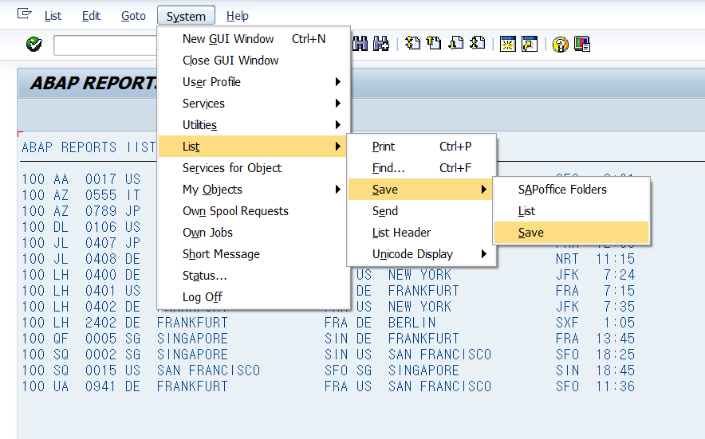
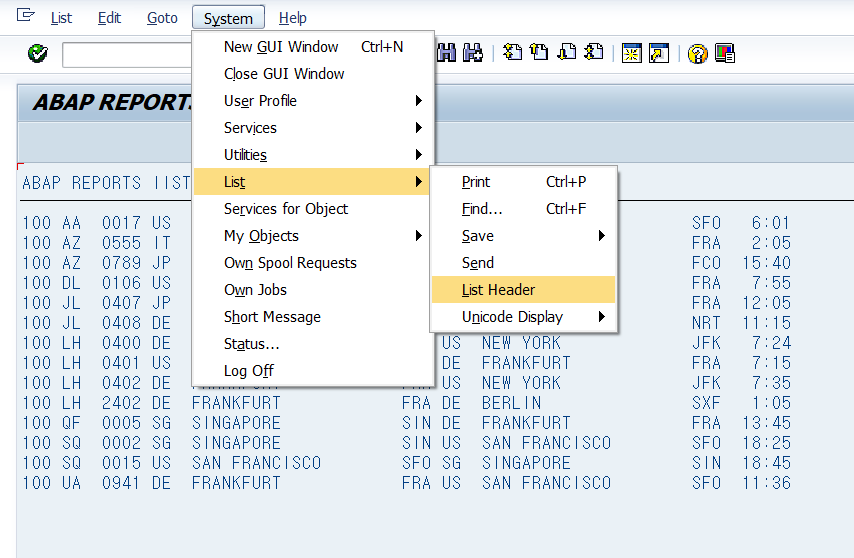
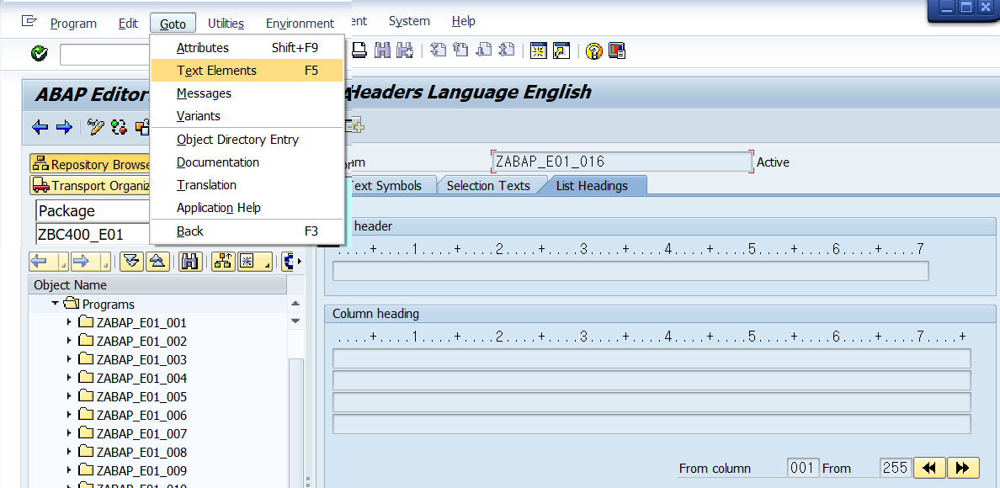
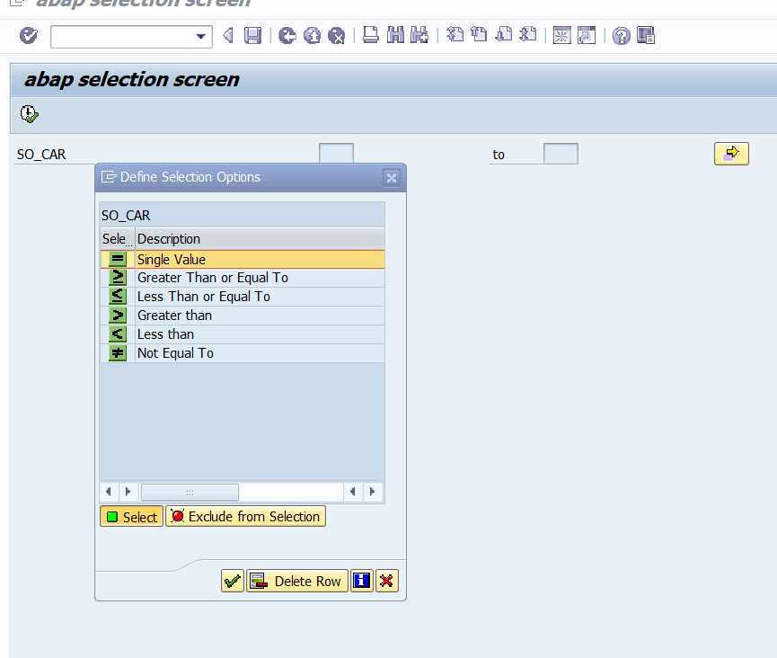
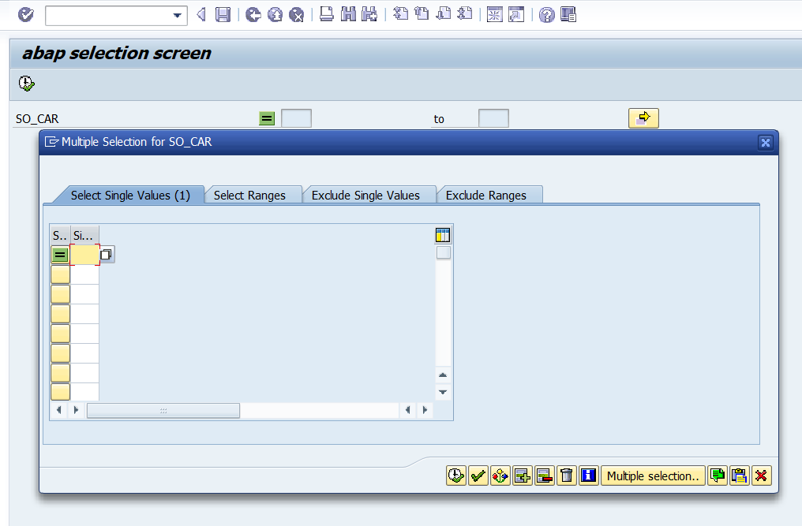

# CLASSIC ABAP REPORTs  
    데이터 조회 내용, 계산 결과 등 유저가 요청한 사항에 대해 출력하는 프로그램.
 ## ABAP LIST Feature
    abap list는 조회한 데이터 목록을 출력하는 기본적인 리포트

- Basic 리스트 Function

    뒤로가기, 나가기, 취소. 출력, 찾기, Scroll.
 - 조회한 LIst Reports 파일로 저장하기
 
- 조회 리스트 Header 관리하기
    - 리포트 화면에서 직접 교체  
  
    - Goto- text elements에서 관리하기  



<hr>

 ## IMPLEMENTING SELECTION SCREEN
 &nbsp; &nbsp; &nbsp;**B2.p518**  
    selcection Screen의 옵션 설정은 여러 방법이 가능함.
    입력 인자 이름은 최대 8글자까지만 가능함.

 ### **PARAMETERS**  

 &nbsp;&nbsp;&nbsp;&nbsp;&nbsp;&nbsp;
 <B>정의 : INPUT SINGLE VALUE</B>

 - 1:1 input 인자 요구 방법
 - data type을 이용한 입력 값을 제한할 수 있다.
 - 필드 라벨을 이용해 입력창 라벨 설정이 가능하다.(Text Elements)
 - 입력 가능한 값을 f4(serch help)로 디스플레이할 수 있도록 설정할 수 있다.
<p></p>

- 예시
```abap
    parameters '입력 변수명' type '타입명'
    parameters '입력 변수명' type '스트럭쳐명'-'필드명'
```
- 예시 2
```abap
    PARAMETERS : pa_carr TYPE scarr-carrid Default 'AA'.

        SELECT *
        INTO TABLE gt_connect
        FROM spfli
        where carrid = pa_carr.
```
<hr>

### **SELECT-OPTION**  
 &nbsp; &nbsp; &nbsp;**B2.P521**  
 &nbsp;&nbsp;&nbsp;&nbsp;&nbsp;&nbsp;
 <B>정의 : INPUT MULTIPLE VALUE</B><br>
 <ul>
    <li> 입력 값에 대한 다중 조건 설정 가능</li>
    <li> single & multiple 선택이 가능</li>
    <li> Text Elements에서 Selection Text를 설정할 수 있는데<br>
      여기서 semantic 속성<sup>[1]</sup>이 있다면 DICC설정을 체크하여 <br>
      라벨을 자동적으로 불러올 수 있다.  </li>
    <li>의미적 속성은 '스트럭처'-'필드'와 같이 구조적 정보를 담고 있는 데이터 타입에서 복사된다.</li>
</ul>
<ul><b> 예시</b></ul>

```abap
    *기술적 속성만 가진 타입 
    data: pa_car type s_carr_id.

    * 의미적 속성도 알 수 있는 타입
    data: pa_car type spfil-carrid.
```


[Select Option](/ABAP_source_code/week2/select-option.abap)

### Multiple select
&nbsp;&nbsp;**B2.P524**&nbsp;&nbsp;&nbsp;**손코딩 예시**

``` abap
    select-options 'SO_변수명' FOR '필드명'(복합 데이터 변수의).
    ----------------------------------------------------------
    data : gs_spfli type spfil.
    select-options so_car for gs_spfli-carrid.

    SELECT *
    FROM spfli
    INTO CORRESPONDING FIELDS OF TABLE gt_spfli
    WHERE carrid IN so_car.
```
 위의 예시에서 so_car은 다중선택이 가능한 선택 옵션이 되고,<br>
 so_car 인터널 테이블이 자동 생성된다.<br>
 EndUser의 선택에 따라 4개필드에 입력된다.
 
 |Sign|Option|Low|High|
 |:---:|:---:|:---:|:---:|
 |포함여부|조건연산자|최소값|최대값|
 |I|EQ|||
 |Inclusive|동일함|해당값|해당값|
 |E|BT|||
 |Exclusive|비트윈|||
 |위 두개가<br>끝!|...|||
 
위 상항에서 손코딩으로 조건값을 입력하기 위해서는 인터널 테이블로 인식된 so_car를 스트럭쳐 헤드라인으로 변환해야한다.<br>
```
    so_car   => type Internal Table
    so_car[] => type Structure
```


---

#### Select-Option의 구동 후 모습 <br>

 1. Option명 Double 클릭!
    <br>

 2. 다중 옵션 선택
    


---
 ## EVENTS OF REPORTS 

&nbsp;&nbsp;&nbsp;&nbsp;<b>B2.p534</b>

|시간순|설명|Event|ABAP 구현|
|:---:|:---:|:---:|:---:|
|1|프로그램<br>구동|Prgram start|`Report ...`<br>|
|2|최초값<br> 설정|INITIALIZATION|`INITIALIZATION.`<br>`최초값 소스코드`<br>`Parameter ...`<br>`DATA ...`|
|3|입력값 오류 체크 <br> Input 진행|AT<br> SELECTION<br> SCREEN|`AT-SELECTION-SCREEN.`<br>`소스코드`|
|4|메인<br>프로그램|start<br>of<br>selection|`start-of-selection.`<br>`메인 소스코드`|

### 이벤트 블록의 특징
&nbsp;&nbsp;&nbsp;&nbsp;**B2.P536**

- 이벤트 이름과 ABAP키워드가 동일하다.
- 이벤트 키워드에서부터 다음 이벤트 키워드까지를 **단일 블럭**으로 묶인다.
- 같은 이벤트를 **중복하여 사용할 수 없다.**
- 필수 사용이 아닌 **Optional 한 기능**이다.
- 이벤트 구문의 손코딩 <u>**작성 순서는 중요하지 않다.**</u>
    - 프로그램 동작시 코딩순이 아니라 **이벤트 순서대로** 진행된다.
    - 일반적으로는 가독성을 위해 이벤트 절차에 맞춰 코딩한다.
- 어떠한 이벤트 구문이 오지 않다면,<br> ABAP은 기본적으로 해당 프로그램 전체를 **START-OF-SELECTION**으로 간주한다.

<p><br><br><br></p>

<hr>
<a name="foot1">Semantic Atribute : </a>의미론적 속성을 의미한다. 기술적 속성에는 데이터 타입, 길이와 같은 기능적 활용에 필요한 정보를 담고 있다면, 의미론적 속성에는 해당 데이터의 구조(Itab - structure - Data Element)적 정보를 포함한다.